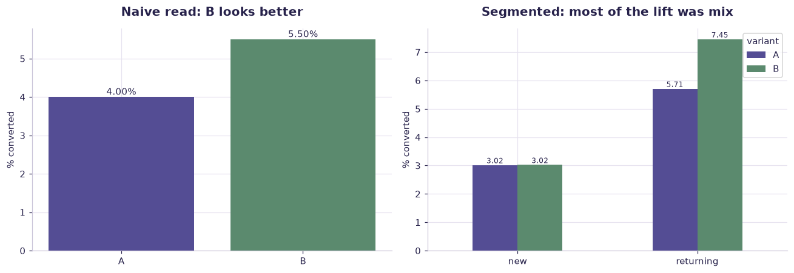

# Marketing A/B test (2,400 users) — worked solution

[](https://colab.research.google.com/github/RGarancs/applied-ai-academy-labs/blob/main/solutions/abtest.ipynb) &nbsp; [← back to the problem set](../abtest.ipynb)

**2,400 rows** · `marketing_ab_test.csv`

> Every number and chart below is the real output of the code shown.
> Try the problems yourself first — the point is the attempt, not the answer.

---

## Setup

<details><summary>Output</summary>

```
Shape: (2400, 6)
  user_id variant  user_type channel  converted  revenue_eur
0   U0001       A        new   email          1         62.0
1   U0002       B        new   email          0          0.0
2   U0003       A        new   email          0          0.0
3   U0004       B  returning   email          0          0.0
4   U0005       A        new  direct          0          0.0
```

</details>

## What is in the file

```python
print("Columns and types:")
print(df.dtypes.to_string())
miss = df.isna().sum()
miss = miss[miss > 0]
print("\nMissing values:" if len(miss) else "\nNo missing values.")
if len(miss): print(miss.to_string())
```

<details><summary>Output</summary>

```
Columns and types:
user_id            str
variant            str
user_type          str
channel            str
converted        int64
revenue_eur    float64

No missing values.
```

</details>

## Problem 1 · Easy — describe

Read the headline result.

*Try it yourself first. The worked solution is below.*

```python
res = (df.groupby("variant")
         .agg(users=("user_id","size"), conversions=("converted","sum"),
              conv_rate=("converted","mean"), revenue=("revenue_eur","sum"))
         .round(4))
res["conv_rate_%"] = (res["conv_rate"]*100).round(2)
print(res)
a, b = res.loc["A","conv_rate"], res.loc["B","conv_rate"]
print(f"\nNaive read: B beats A by {(b-a)*100:.2f} percentage points.")
```

<details><summary>Output</summary>

```
         users  conversions  conv_rate  revenue  conv_rate_%
variant                                                     
A         1200           48      0.040  3202.67          4.0
B         1200           66      0.055  4012.70          5.5

Naive read: B beats A by 1.50 percentage points.
```

</details>

## Problem 2 · Intermediate — build

Now split by user type — and watch the result change.

*Try it yourself first. The worked solution is below.*

```python
seg = (df.groupby(["user_type","variant"])
         .agg(users=("user_id","size"), conv_rate=("converted","mean")).round(4))
seg["conv_rate_%"] = (seg["conv_rate"]*100).round(2)
print(seg)

print("\nLift within each segment (B - A, percentage points):")
for ut in df["user_type"].unique():
    s = df[df["user_type"] == ut]
    a = s[s.variant=="A"]["converted"].mean(); b = s[s.variant=="B"]["converted"].mean()
    print(f"  {ut:<12} {(b-a)*100:+.2f} pp")

print("\nMix check — how the variants were split across user types:")
print(pd.crosstab(df["user_type"], df["variant"], normalize="columns").round(3))
```

<details><summary>Output</summary>

```
                   users  conv_rate  conv_rate_%
user_type variant                               
new       A          762     0.0302         3.02
          B          529     0.0302         3.02
returning A          438     0.0571         5.71
          B          671     0.0745         7.45

Lift within each segment (B - A, percentage points):
  new          +0.01 pp
  returning    +1.74 pp

Mix check — how the variants were split across user types:
variant        A      B
user_type              
new        0.635  0.441
returning  0.365  0.559
```

</details>

## Problem 3 · Advanced — judge

Test significance, then decide what you would actually tell the business.

*Try it yourself first. The worked solution is below.*

```python
from scipy import stats
tab = pd.crosstab(df["variant"], df["converted"])
chi2, p, _, _ = stats.chi2_contingency(tab)
print(f"Overall chi-square p-value: {p:.4f}")

for ut in df["user_type"].unique():
    s = df[df["user_type"] == ut]
    t = pd.crosstab(s["variant"], s["converted"])
    if t.shape == (2,2) and t.values.min() >= 5:
        _, pp, _, _ = stats.chi2_contingency(t)
        print(f"  {ut:<12} p = {pp:.4f}")

print("\nThis is Simpson's paradox: an aggregate lift that is really a mix effect.")
print("Report the segmented result, or you will ship a change that does nothing.")
```

<details><summary>Output</summary>

```
Overall chi-square p-value: 0.1028
  new          p = 1.0000
  returning    p = 0.3134

This is Simpson's paradox: an aggregate lift that is really a mix effect.
Report the segmented result, or you will ship a change that does nothing.
```

</details>

## Visual summary

The same answers, as pictures. These are what to project — a room reads a chart
far faster than it reads a table, and the shape of a result is usually the
argument you are actually making.

```python
fig, ax = plt.subplots(1, 2, figsize=(12, 4.2))
o = df.groupby("variant")["converted"].mean().mul(100)
b = ax[0].bar(o.index, o.values, color=[ACCENT, CORE])
ax[0].bar_label(b, fmt="%.2f%%", fontsize=10)
ax[0].set_title("Naive read: B looks better"); ax[0].set_ylabel("% converted")

seg = df.groupby(["user_type","variant"])["converted"].mean().mul(100).unstack()
seg.plot(kind="bar", ax=ax[1], color=[ACCENT, CORE], rot=0)
ax[1].set_title("Segmented: most of the lift was mix"); ax[1].set_ylabel("% converted"); ax[1].set_xlabel("")
for c in ax[1].containers: ax[1].bar_label(c, fmt="%.2f", fontsize=8)
plt.tight_layout(); plt.show()
```



<details><summary>Output</summary>

```
findfont: Failed to find font weight 600, now using 700.
```

</details>

## Verified answer key

These are the numbers the academy ships for this dataset. They were computed
from this exact file — if your run disagrees, reconcile before teaching it.

1. Naive read: A 4.00% vs B 5.50% — "B wins by +1.5pp!"
2. Segmented: NEW users A 3.02% vs B 3.02% — zero difference; RETURNING A 5.71% vs B 7.45%
3. The trap: B's traffic skews returning (55% vs 35%) — part of its naive lift is mix, not effect
4. The honest conclusion: B genuinely helps returning users; for new users it does nothing — segment before you ship

## Teaching notes

* **Run the Easy problem live.** It sets the shared vocabulary and gets everyone
  looking at the same rows.
* **Let them fail on the Intermediate one.** The productive mistake is usually
  reaching for a model before checking the data.
* **Argue about the Advanced one.** It has no single right answer; it has a
  defensible one, and defending it is the skill being taught.
* **Always close on limitations.** Every dataset here has a real caveat —
  scrape bias, a tiny sample, a hindsight label. Naming it is the lesson.
* **Deliverable for learners:** ROI model v1 + prioritised portfolio with one explicit stop decision.

---
*Applied AI Academy · appliedai.center*

---

*Applied AI Academy · [appliedai.center](https://appliedai.center)*
