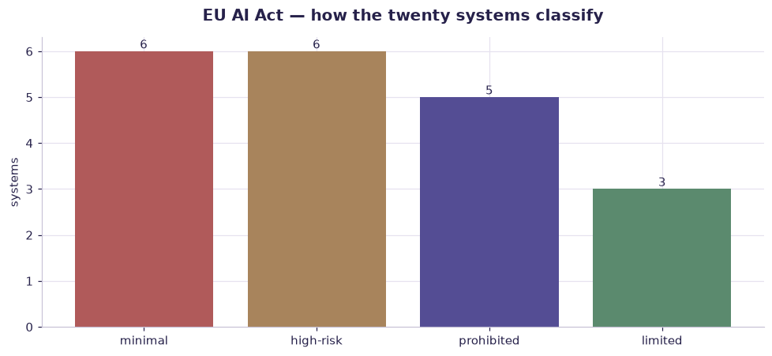

# EU AI Act classification exercise (20 systems) — worked solution

[](https://colab.research.google.com/github/RGarancs/applied-ai-academy-labs/blob/main/solutions/aiact.ipynb) &nbsp; [← back to the problem set](../aiact.ipynb)

**20 rows** · `eu_ai_act_classification.csv`

> Every number and chart below is the real output of the code shown.
> Try the problems yourself first — the point is the attempt, not the answer.

---

## Setup

<details><summary>Output</summary>

```
Shape: (20, 4)
                              system                                        description correct_tier  \
0    Spam filter for corporate email                    Filters unwanted email using ML      minimal   
1  CV screening & ranking for hiring                    Scores and ranks job applicants    high-risk   
2           Customer service chatbot             Answers product questions on a website      limited   
3            Consumer credit scoring           Scores natural persons for loan approval    high-risk   
4          Marketing video generator  Creates promotional videos with synthetic pres...      limited   

                                           rationale  
0   No Annex III category; negligible rights impact.  
1  Employment (Annex III): bias testing, transpar...  
2  Transparency duty: users must know they talk t...  
3  Essential services (Annex III): documentation,...  
4  Synthetic content must be labelled; deepfake-t...
```

</details>

## What is in the file

```python
print("Columns and types:")
print(df.dtypes.to_string())
miss = df.isna().sum()
miss = miss[miss > 0]
print("\nMissing values:" if len(miss) else "\nNo missing values.")
if len(miss): print(miss.to_string())
```

<details><summary>Output</summary>

```
Columns and types:
system          str
description     str
correct_tier    str
rationale       str

No missing values.
```

</details>

## Problem 1 · Easy — describe

Read the twenty systems and classify them yourself before looking.

*Try it yourself first. The worked solution is below.*

```python
print(df[["system","description"]].to_string(index=False, max_colwidth=78))
```

<details><summary>Output</summary>

```
                                    system                                          description
           Spam filter for corporate email                      Filters unwanted email using ML
         CV screening & ranking for hiring                      Scores and ranks job applicants
                  Customer service chatbot               Answers product questions on a website
                   Consumer credit scoring             Scores natural persons for loan approval
                 Marketing video generator Creates promotional videos with synthetic presenters
    Emotion recognition in exam proctoring                Detects student emotions during exams
          Predictive maintenance for pumps                Predicts industrial equipment failure
Social scoring by loyalty 'citizen points'              Gates services based on behaviour score
                    Exam grading assistant               Scores student essays for final grades
              Warehouse robot path planner                Optimises robot routes in a warehouse
                     Emergency call triage                     Prioritises 112 calls by urgency
                     AI meme generator app                    Creates funny images from prompts
 Biometric ID in public square (real-time)                  Live face ID for policing in public
Insurance premium pricing for health cover                   Prices individual health insurance
          Code autocomplete for developers                             Suggests code in the IDE
                        Border visa triage                 Recommends visa application outcomes
               Music recommendation engine                               Personalises playlists
  Manipulative dark-pattern shopping agent           Exploits vulnerabilities to push purchases
    Workplace productivity emotion tracker                Monitors employee emotions via webcam
          Internal knowledge RAG assistant           Answers staff questions from internal docs
```

</details>

## Problem 2 · Intermediate — build

Check yourself against the official tiers.

*Try it yourself first. The worked solution is below.*

```python
print(df["correct_tier"].value_counts(), "\n")
print(df[["system","correct_tier"]].to_string(index=False))
```

<details><summary>Output</summary>

```
correct_tier
minimal       6
high-risk     6
prohibited    5
limited       3
Name: count, dtype: int64 

                                    system correct_tier
           Spam filter for corporate email      minimal
         CV screening & ranking for hiring    high-risk
                  Customer service chatbot      limited
                   Consumer credit scoring    high-risk
                 Marketing video generator      limited
    Emotion recognition in exam proctoring   prohibited
          Predictive maintenance for pumps      minimal
Social scoring by loyalty 'citizen points'   prohibited
                    Exam grading assistant    high-risk
              Warehouse robot path planner      minimal
                     Emergency call triage    high-risk
                     AI meme generator app      limited
 Biometric ID in public square (real-time)   prohibited
Insurance premium pricing for health cover    high-risk
          Code autocomplete for developers      minimal
                        Border visa triage    high-risk
               Music recommendation engine      minimal
  Manipulative dark-pattern shopping agent   prohibited
    Workplace productivity emotion tracker   prohibited
          Internal knowledge RAG assistant      minimal
```

</details>

## Problem 3 · Advanced — judge

Read the rationales — the reasoning is the transferable part.

*Try it yourself first. The worked solution is below.*

```python
for _, r in df.iterrows():
    print(f"\n{r['system']}\n  TIER: {r['correct_tier']}\n  WHY : {r['rationale']}")
```

<details><summary>Output</summary>

```

Spam filter for corporate email
  TIER: minimal
  WHY : No Annex III category; negligible rights impact.

CV screening & ranking for hiring
  TIER: high-risk
  WHY : Employment (Annex III): bias testing, transparency, human oversight required.

Customer service chatbot
  TIER: limited
  WHY : Transparency duty: users must know they talk to AI (Art. 50).

Consumer credit scoring
  TIER: high-risk
  WHY : Essential services (Annex III): documentation, oversight, robustness.

Marketing video generator
  TIER: limited
  WHY : Synthetic content must be labelled; deepfake-type disclosure.

Emotion recognition in exam proctoring
  TIER: prohibited
  WHY : Emotion recognition in education is banned (Art. 5).

Predictive maintenance for pumps
  TIER: minimal
  WHY : No rights impact; unless safety component under sector law.

Social scoring by loyalty 'citizen points'
  TIER: prohibited
  WHY : Social scoring is a banned practice (Art. 5).

Exam grading assistant
  TIER: high-risk
  WHY : Education (Annex III): affects access to education.

Warehouse robot path planner
  TIER: minimal
  WHY : Industrial optimisation; product-safety law may apply separately.

Emergency call triage
  TIER: high-risk
  WHY : Essential public services (Annex III).

AI meme generator app
  TIER: limited
  WHY : Synthetic content labelling; otherwise minimal.

Biometric ID in public square (real-time)
  TIER: prohibited
  WHY : Real-time remote biometric ID in public is banned bar narrow exceptions.

Insurance premium pricing for health cover
  TIER: high-risk
  WHY : Essential private services (Annex III): access to insurance.

Code autocomplete for developers
  TIER: minimal
  WHY : Developer tool; negligible rights impact.

Border visa triage
  TIER: high-risk
  WHY : Migration/border control (Annex III).

Music recommendation engine
  TIER: minimal
  WHY : Consumer personalisation; minimal risk.

Manipulative dark-pattern shopping agent
  TIER: prohibited
  WHY : Manipulative techniques causing harm are banned (Art. 5).

Workplace productivity emotion tracker
  TIER: prohibited
  WHY : Emotion recognition at work is banned (Art. 5).

Internal knowledge RAG assistant
  TIER: minimal
  WHY : Internal productivity; GDPR applies to personal data anyway.
```

</details>

## Visual summary

The same answers, as pictures. These are what to project — a room reads a chart
far faster than it reads a table, and the shape of a result is usually the
argument you are actually making.

```python
r = df["correct_tier"].value_counts()
fig, ax = plt.subplots(figsize=(9, 4.2))
b = ax.bar(r.index.astype(str), r.values, color=[DANGER, BUILDER, ACCENT, CORE][:len(r)])
ax.bar_label(b, fontsize=10)
ax.set_title("EU AI Act — how the twenty systems classify"); ax.set_ylabel("systems")
plt.tight_layout(); plt.show()
```



<details><summary>Output</summary>

```
findfont: Failed to find font weight 600, now using 700.
```

</details>

## Verified answer key

These are the numbers the academy ships for this dataset. They were computed
from this exact file — if your run disagrees, reconcile before teaching it.

1. Tier mix: 6 minimal · 6 high-risk · 3 limited/transparency · 5 prohibited
2. The 5 prohibited: exam-proctoring emotion detection, workplace emotion tracking, social scoring, real-time public biometric ID, manipulative dark-pattern agents
3. The classic confusions: chatbots are LIMITED not minimal (disclosure duty); grading assistants are HIGH-RISK (education access); internal RAG is minimal (but GDPR still applies)

## Teaching notes

* **Run the Easy problem live.** It sets the shared vocabulary and gets everyone
  looking at the same rows.
* **Let them fail on the Intermediate one.** The productive mistake is usually
  reaching for a model before checking the data.
* **Argue about the Advanced one.** It has no single right answer; it has a
  defensible one, and defending it is the skill being taught.
* **Always close on limitations.** Every dataset here has a real caveat —
  scrape bias, a tiny sample, a hindsight label. Naming it is the lesson.
* **Deliverable for learners:** Risk-tier classification of the 8 systems + one completed compliance canvas.

---
*Applied AI Academy · appliedai.center*

---

*Applied AI Academy · [appliedai.center](https://appliedai.center)*
