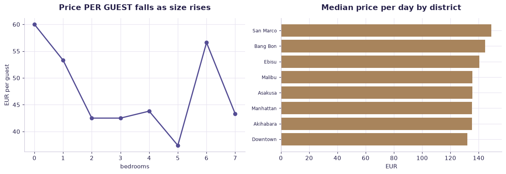

# Airbnb Paris — pricing (case study) — worked solution

[](https://colab.research.google.com/github/RGarancs/applied-ai-academy-labs/blob/main/solutions/airbnb.ipynb) &nbsp; [← back to the problem set](../airbnb.ipynb)

**11,241 rows** · `airbnb_paris.csv`

> Every number and chart below is the real output of the code shown.
> Try the problems yourself first — the point is the attempt, not the answer.

---

## Setup

<details><summary>Output</summary>

```
Shape: (11241, 19)
   PricePerGuest  #Bedrooms  #Beds  Guests  #Bathrooms  RealBed?  StrictCancellationPolicy?  CleaningFee?  \
0          466.0          0      1       1         1.0         1                          0             0   
1          300.0          1      1       1         1.0         1                          0             0   
2          280.0          1      1       1         1.0         1                          0             0   
3          275.0          1      1       1         1.0         1                          1             1   
4          269.0          0      1       1         1.0         1                          0             1   

   HostIdentityVerified?  InstantBooking?  AvgReviewScore    #ID  CityID  DistrictID    City   District  \
0                      0                0             100   9943      10           1   Tokyo  Akihabara   
1                      1                0             100  10589      10           4   Tokyo  Shimbashi   
2                      1                0              93   9502       9           4  Venice  Dorsoduro   
3                      1                0              97  10517      10           3   Tokyo      Ebisu   
4                      1                1              93  10945      10           6   Tokyo      Ebisu   

   Price per Day USD  Price per Day EUR  Avg Price per Month EUR  
0              466.0            396.566             12070.477625  
1              300.0            255.300              7770.693750  
2              280.0            238.280              7252.647500  
3              275.0            234.025              7123.135938  
4              269.0            228.919              6967.722062
```

</details>

## What is in the file

```python
print("Columns and types:")
print(df.dtypes.to_string())
miss = df.isna().sum()
miss = miss[miss > 0]
print("\nMissing values:" if len(miss) else "\nNo missing values.")
if len(miss): print(miss.to_string())
```

<details><summary>Output</summary>

```
Columns and types:
PricePerGuest                float64
#Bedrooms                      int64
#Beds                          int64
Guests                         int64
#Bathrooms                   float64
RealBed?                       int64
StrictCancellationPolicy?      int64
CleaningFee?                   int64
HostIdentityVerified?          int64
InstantBooking?                int64
AvgReviewScore                 int64
#ID                            int64
CityID                         int64
DistrictID                     int64
City                             str
District                         str
Price per Day USD            float64
Price per Day EUR            float64
Avg Price per Month EUR      float64

No missing values.
```

</details>

## Problem 1 · Easy — describe

Describe the Paris listing market.

*Try it yourself first. The worked solution is below.*

```python
print(f"Listings: {len(df):,}")
price = "Price per Day EUR"
print(f"\nPrice per day (EUR):\n{df[price].describe().round(1)}")
print(f"\nMedian price per guest: EUR {df['PricePerGuest'].median():.1f}")
print("\nBy bedrooms:")
print(df.groupby("#Bedrooms").agg(n=(price,"size"), median_price=(price,"median"),
                                  median_per_guest=("PricePerGuest","median")).head(8).round(1))
```

<details><summary>Output</summary>

```
Listings: 11,241

Price per day (EUR):
count    11241.0
mean       155.6
std         90.3
min          4.3
25%        102.1
50%        132.0
75%        174.6
max       1680.7
Name: Price per Day EUR, dtype: float64

Median price per guest: EUR 50.0

By bedrooms:
              n  median_price  median_per_guest
#Bedrooms                                      
0          1975         119.1              60.0
1          5970         127.6              53.3
2          2541         166.1              42.5
3           620         233.9              42.5
4           113         330.9              43.8
5            15         298.2              37.4
6             4         639.1              56.6
7             3         552.7              43.3
```

</details>

## Problem 2 · Intermediate — build

Find the counter-intuitive result about price per guest.

*Try it yourself first. The worked solution is below.*

```python
g = df.groupby("#Bedrooms")["PricePerGuest"].agg(n="size", mean="mean", median="median").round(1)
print(g.head(8))
print("\nPrice PER GUEST falls as the property gets bigger — bigger places are")
print("cheaper per head. Averages over listings would have hidden this entirely.")
print("\nBy district (top 8 by volume):")
top = df["District"].value_counts().head(8).index
print(df[df["District"].isin(top)].groupby("District")["Price per Day EUR"]
        .agg(n="size", median="median").sort_values("median", ascending=False).round(1))
```

<details><summary>Output</summary>

```
              n  mean  median
#Bedrooms                    
0          1975  65.0    60.0
1          5970  60.3    53.3
2          2541  47.9    42.5
3           620  47.5    42.5
4           113  48.4    43.8
5            15  44.9    37.4
6             4  57.0    56.6
7             3  44.6    43.3

Price PER GUEST falls as the property gets bigger — bigger places are
cheaper per head. Averages over listings would have hidden this entirely.

By district (top 8 by volume):
             n  median
District              
San Marco  300   148.9
Bang Bon   249   144.7
Ebisu      270   140.4
Malibu     260   135.7
Asakusa    251   135.5
Akihabara  249   135.3
Manhattan  321   135.3
Downtown   498   131.9
```

</details>

## Problem 3 · Advanced — judge

Which attributes actually move price?

*Try it yourself first. The worked solution is below.*

```python
from sklearn.ensemble import RandomForestRegressor
from sklearn.model_selection import train_test_split
from sklearn.metrics import mean_absolute_error

price = "Price per Day EUR"
d = df.dropna(subset=[price]).copy()
d = d[d[price].between(10, 1000)]
feat = ["#Bedrooms","#Beds","Guests","#Bathrooms","RealBed?","StrictCancellationPolicy?",
        "CleaningFee?","HostIdentityVerified?","InstantBooking?","AvgReviewScore"]
X, y = d[feat].fillna(0), d[price]
Xtr, Xte, ytr, yte = train_test_split(X, y, test_size=.25, random_state=42)
m = RandomForestRegressor(n_estimators=200, random_state=42, n_jobs=-1).fit(Xtr, ytr)
print(f"MAE: EUR {mean_absolute_error(yte, m.predict(Xte)):.1f}  on a median of EUR {y.median():.0f}")
print("\nFeature importance:\n",
      pd.Series(m.feature_importances_, index=feat).sort_values(ascending=False).round(3))
print("\nCapacity dominates; trust signals (reviews, verification) matter far less")
print("than hosts believe. Location is missing from these features — add District")
print("and the picture changes again.")
```

<details><summary>Output</summary>

```
MAE: EUR 52.9  on a median of EUR 132

Feature importance:
 #Bathrooms                   0.297
Guests                       0.204
AvgReviewScore               0.186
#Beds                        0.091
#Bedrooms                    0.076
HostIdentityVerified?        0.044
InstantBooking?              0.042
StrictCancellationPolicy?    0.030
CleaningFee?                 0.026
RealBed?                     0.004
dtype: float64

Capacity dominates; trust signals (reviews, verification) matter far less
than hosts believe. Location is missing from these features — add District
and the picture changes again.
```

</details>

## Visual summary

The same answers, as pictures. These are what to project — a room reads a chart
far faster than it reads a table, and the shape of a result is usually the
argument you are actually making.

```python
price = "Price per Day EUR"
fig, ax = plt.subplots(1, 2, figsize=(12, 4.2))
g = df.groupby("#Bedrooms")["PricePerGuest"].median().head(8)
ax[0].plot(g.index, g.values, marker="o", color=ACCENT, lw=2)
ax[0].set_title("Price PER GUEST falls as size rises"); ax[0].set_xlabel("bedrooms"); ax[0].set_ylabel("EUR per guest")

top = df["District"].value_counts().head(8).index
m = df[df["District"].isin(top)].groupby("District")[price].median().sort_values()
ax[1].barh(m.index, m.values, color=BUILDER)
ax[1].set_title("Median price per day by district"); ax[1].set_xlabel("EUR")
ax[1].tick_params(axis="y", labelsize=8)
plt.tight_layout(); plt.show()
```



<details><summary>Output</summary>

```
findfont: Failed to find font weight 600, now using 700.
```

</details>

## Verified answer key

These are the numbers the academy ships for this dataset. They were computed
from this exact file — if your run disagrees, reconcile before teaching it.

1. Price/guest: mean €57 · median €50 · range €2–€466 (a right-skewed target — model the median, not the mean)
2. Counter-intuitive: price/guest FALLS as bedrooms rise (studio €65 → 3-bed €47) — per-guest economics, not per-listing
3. Instant-booking listings are slightly cheaper (€53 vs €59) — convenience trades against price
4. Review score band 90–100 → €59 vs €50 below — quality commands a modest premium
5. The investor question needs assumptions AI can't supply: occupancy rate, cleaning/turnover cost, regulation (Paris caps short-term lets), and financing

## Teaching notes

* **Run the Easy problem live.** It sets the shared vocabulary and gets everyone
  looking at the same rows.
* **Let them fail on the Intermediate one.** The productive mistake is usually
  reaching for a model before checking the data.
* **Argue about the Advanced one.** It has no single right answer; it has a
  defensible one, and defending it is the skill being taught.
* **Always close on limitations.** Every dataset here has a real caveat —
  scrape bias, a tiny sample, a hindsight label. Naming it is the lesson.


---
*Applied AI Academy · appliedai.center*

---

*Applied AI Academy · [appliedai.center](https://appliedai.center)*
