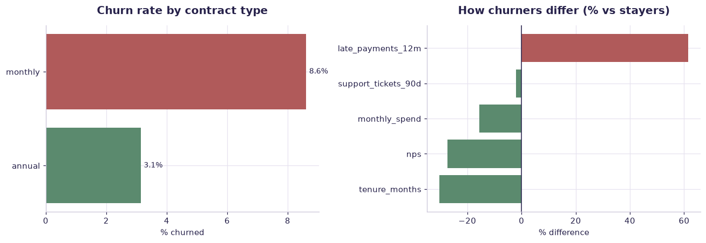

# Customer churn (synthetic) — worked solution

[](https://colab.research.google.com/github/RGarancs/applied-ai-academy-labs/blob/main/solutions/churn.ipynb) &nbsp; [← back to the problem set](../churn.ipynb)

**400 rows** · `customer_churn_synthetic.csv`

> Every number and chart below is the real output of the code shown.
> Try the problems yourself first — the point is the attempt, not the answer.

---

## Setup

<details><summary>Output</summary>

```
Shape: (400, 9)
  customer_id  tenure_months  monthly_spend  support_tickets_90d  late_payments_12m  product_count  nps contract_type  \
0       C0001             15         108.76                    0                  2              1   10       monthly   
1       C0002              5          88.77                    0                  0              1    8       monthly   
2       C0003             70          56.34                    0                  3              1    2       monthly   
3       C0004             20         100.87                    0                  3              2    1       monthly   
4       C0005             46         108.47                    2                  2              2    8       monthly   

   churned  
0        0  
1        0  
2        0  
3        0  
4        0
```

</details>

## What is in the file

```python
print("Columns and types:")
print(df.dtypes.to_string())
miss = df.isna().sum()
miss = miss[miss > 0]
print("\nMissing values:" if len(miss) else "\nNo missing values.")
if len(miss): print(miss.to_string())
```

<details><summary>Output</summary>

```
Columns and types:
customer_id                str
tenure_months            int64
monthly_spend          float64
support_tickets_90d      int64
late_payments_12m        int64
product_count            int64
nps                      int64
contract_type              str
churned                  int64

No missing values.
```

</details>

## Problem 1 · Easy — describe

Baseline: how many customers churn, and does that differ by contract type?

*Try it yourself first. The worked solution is below.*

```python
base = df["churned"].mean()
print(f"Overall churn rate: {base:.1%}  ({df['churned'].sum()} of {len(df)})")

by_contract = (df.groupby("contract_type")["churned"]
                 .agg(customers="size", churned="sum", rate="mean")
                 .sort_values("rate", ascending=False))
by_contract["rate"] = (by_contract["rate"] * 100).round(1)
print("\nChurn by contract type (%):")
print(by_contract)
```

<details><summary>Output</summary>

```
Overall churn rate: 6.0%  (24 of 400)

Churn by contract type (%):
               customers  churned  rate
contract_type                          
monthly              209       18   8.6
annual               191        6   3.1
```

</details>

## Problem 2 · Intermediate — build

Which behaviours separate churners from stayers?

*Try it yourself first. The worked solution is below.*

```python
num = ["tenure_months","monthly_spend","support_tickets_90d",
       "late_payments_12m","product_count","nps"]
comp = df.groupby("churned")[num].mean().T
comp.columns = ["stayed","churned"]
comp["gap"] = comp["churned"] - comp["stayed"]
comp["gap_%_of_stayed"] = (comp["gap"] / comp["stayed"] * 100).round(1)
print(comp.round(2).sort_values("gap_%_of_stayed", key=abs, ascending=False))
```

<details><summary>Output</summary>

```
                     stayed  churned    gap  gap_%_of_stayed
late_payments_12m      1.03     1.67   0.63             61.5
tenure_months         37.97    26.50 -11.47            -30.2
nps                    5.39     3.92  -1.47            -27.3
monthly_spend         83.76    70.73 -13.03            -15.6
product_count          2.19     2.04  -0.15             -6.9
support_tickets_90d    1.19     1.17  -0.02             -2.1
```

</details>

## Problem 3 · Advanced — judge

Threshold economics: at what score do retention offers stop paying?

*Try it yourself first. The worked solution is below.*

```python
from sklearn.linear_model import LogisticRegression
from sklearn.model_selection import train_test_split
from sklearn.metrics import roc_auc_score

X = pd.get_dummies(df[["tenure_months","monthly_spend","support_tickets_90d",
                       "late_payments_12m","product_count","nps","contract_type"]],
                   drop_first=True)
y = df["churned"]
Xtr, Xte, ytr, yte = train_test_split(X, y, test_size=.3, random_state=42, stratify=y)
m = LogisticRegression(max_iter=2000).fit(Xtr, ytr)
p = m.predict_proba(Xte)[:, 1]
print(f"AUC: {roc_auc_score(yte, p):.3f}")

# The business question is NOT accuracy — it is whether an offer pays.
OFFER_COST, SAVED_VALUE, SAVE_RATE = 25, 300, 0.30   # €, €, share persuadable
print("\nthreshold  targeted  true_churners  net_€")
for t in [.2,.3,.4,.5,.6,.7]:
    tgt = p >= t
    n, hits = tgt.sum(), yte[tgt].sum()
    net = hits * SAVE_RATE * SAVED_VALUE - n * OFFER_COST
    print(f"   {t:.1f}      {n:5d}      {hits:5d}       {net:8.0f}")
print("\nThe best threshold is an economics question, not a modelling one.")
```

<details><summary>Output</summary>

```
AUC: 0.675

threshold  targeted  true_churners  net_€
   0.2          8          2            -20
   0.3          2          1             40
   0.4          2          1             40
   0.5          1          1             65
   0.6          0          0              0
   0.7          0          0              0

The best threshold is an economics question, not a modelling one.
```

</details>

## Visual summary

The same answers, as pictures. These are what to project — a room reads a chart
far faster than it reads a table, and the shape of a result is usually the
argument you are actually making.

```python
fig, ax = plt.subplots(1, 2, figsize=(12, 4.2))
r = df.groupby("contract_type")["churned"].mean().mul(100).sort_values()
ax[0].barh(r.index, r.values, color=[CORE if v < r.mean() else DANGER for v in r])
ax[0].set_title("Churn rate by contract type"); ax[0].set_xlabel("% churned")
for i, v in enumerate(r.values): ax[0].text(v + .1, i, f"{v:.1f}%", va="center", fontsize=9)

num = ["tenure_months","monthly_spend","support_tickets_90d","late_payments_12m","nps"]
g = df.groupby("churned")[num].mean()
rel = ((g.loc[1] - g.loc[0]) / g.loc[0] * 100).sort_values()
ax[1].barh(rel.index, rel.values, color=[DANGER if v > 0 else CORE for v in rel])
ax[1].axvline(0, color=INK, lw=1)
ax[1].set_title("How churners differ (% vs stayers)"); ax[1].set_xlabel("% difference")
plt.tight_layout(); plt.show()
```



<details><summary>Output</summary>

```
findfont: Failed to find font weight 600, now using 700.
```

</details>

## Verified answer key

These are the numbers the academy ships for this dataset. They were computed
from this exact file — if your run disagrees, reconcile before teaching it.

1. Churn rate 6.0% (24/400) — beware the accuracy trap
2. Monthly contracts churn 8.6% vs annual 3.1%
3. Churned: lower tenure (26.5 vs 38.0 mo), more late payments (1.67 vs 1.03), lower NPS (3.9 vs 5.4)
4. Support tickets: almost NO signal (1.17 vs 1.19) — the trap feature

## Teaching notes

* **Run the Easy problem live.** It sets the shared vocabulary and gets everyone
  looking at the same rows.
* **Let them fail on the Intermediate one.** The productive mistake is usually
  reaching for a model before checking the data.
* **Argue about the Advanced one.** It has no single right answer; it has a
  defensible one, and defending it is the skill being taught.
* **Always close on limitations.** Every dataset here has a real caveat —
  scrape bias, a tiny sample, a hindsight label. Naming it is the lesson.
* **Deliverable for learners:** A one-page model card: purpose, data, top drivers, chosen threshold + economic reasoning, limitations, owner.

---
*Applied AI Academy · appliedai.center*

---

*Applied AI Academy · [appliedai.center](https://appliedai.center)*
