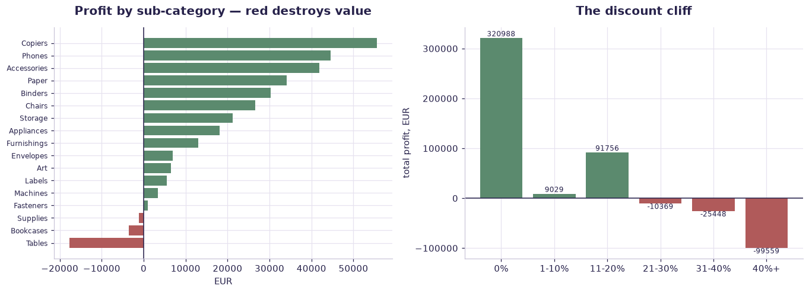

# Dunder Mifflin — retail orders (case study) — worked solution

[](https://colab.research.google.com/github/RGarancs/applied-ai-academy-labs/blob/main/solutions/dundermifflin.ipynb) &nbsp; [← back to the problem set](../dundermifflin.ipynb)

**9,994 rows** · `dunder_mifflin_orders.csv`

> Every number and chart below is the real output of the code shown.
> Try the problems yourself first — the point is the attempt, not the answer.

---

## Setup

<details><summary>Output</summary>

```
Shape: (9994, 22)
   Row ID        Order ID  Order Date   Ship Date       Ship Mode Customer ID    Customer Name    Segment  \
0       1  CA-2017-152156  2017-11-08  2017-11-11    Second Class    CG-12520      Claire Gute   Consumer   
1       2  CA-2017-152156  2017-11-08  2017-11-11    Second Class    CG-12520      Claire Gute   Consumer   
2       3  CA-2017-138688  2017-06-12  2017-06-16    Second Class    DV-13045  Darrin Van Huff  Corporate   
3       4  US-2016-108966  2016-10-11  2016-10-18  Standard Class    SO-20335   Sean O'Donnell   Consumer   
4       5  US-2016-108966  2016-10-11  2016-10-18  Standard Class    SO-20335   Sean O'Donnell   Consumer   

         Country             City       State  Postal Code Region       Product ID         Category Sub-Category  \
0  United States        Henderson    Kentucky      42420.0  South  FUR-BO-10001798        Furniture    Bookcases   
1  United States        Henderson    Kentucky      42420.0  South  FUR-CH-10000454        Furniture       Chairs   
2  United States      Los Angeles  California      90036.0   West  OFF-LA-10000240  Office Supplies       Labels   
3  United States  Fort Lauderdale     Florida      33311.0  South  FUR-TA-10000577        Furniture       Tables   
4  United States  Fort Lauderdale     Florida      33311.0  South  OFF-ST-10000760  Office Supplies      Storage   

                                        Product Name     Sales  Quantity  Discount    Profit Returned  
0                  Bush Somerset Collection Bookcase  261.9600         2      0.00   41.9136       No  
1  Hon Deluxe Fabric Upholstered Stacking Chairs,...  731.9400         3      0.00  219.5820       No  
2  Self-Adhesive Address Labels for Typewriters b...   14.6200         2      0.00    6.8714       No  
3      Bretford CR4500 Series Slim Rectangular Table  957.5775         5      0.45 -383.0310       No  
4                     Eldon Fold 'N Roll Cart System   22.3680         2      0.20    2.5164       No
```

</details>

## What is in the file

```python
print("Columns and types:")
print(df.dtypes.to_string())
miss = df.isna().sum()
miss = miss[miss > 0]
print("\nMissing values:" if len(miss) else "\nNo missing values.")
if len(miss): print(miss.to_string())
```

<details><summary>Output</summary>

```
Columns and types:
Row ID             int64
Order ID             str
Order Date           str
Ship Date            str
Ship Mode            str
Customer ID          str
Customer Name        str
Segment              str
Country              str
City                 str
State                str
Postal Code      float64
Region               str
Product ID           str
Category             str
Sub-Category         str
Product Name         str
Sales            float64
Quantity           int64
Discount         float64
Profit           float64
Returned             str

Missing values:
Postal Code    11
```

</details>

## Problem 1 · Easy — describe

Size the business: sales, profit and margin.

*Try it yourself first. The worked solution is below.*

```python
print(f"Orders: {df['Order ID'].nunique():,}   Rows: {len(df):,}")
print(f"Sales:  EUR {df['Sales'].sum():,.0f}")
print(f"Profit: EUR {df['Profit'].sum():,.0f}")
print(f"Margin: {df['Profit'].sum()/df['Sales'].sum():.1%}")
print("\nBy category:")
print(df.groupby("Category").agg(sales=("Sales","sum"), profit=("Profit","sum"))
        .assign(margin=lambda d: (d.profit/d.sales*100).round(1)).round(0))
```

<details><summary>Output</summary>

```
Orders: 5,009   Rows: 9,994
Sales:  EUR 3,003,514
Profit: EUR 286,397
Margin: 9.5%

By category:
                     sales    profit  margin
Category                                    
Furniture         742000.0   18451.0     2.0
Office Supplies  1425360.0  122491.0     9.0
Technology        836154.0  145455.0    17.0
```

</details>

## Problem 2 · Intermediate — build

Find what loses money — and be specific about it.

*Try it yourself first. The worked solution is below.*

```python
sub = (df.groupby("Sub-Category").agg(sales=("Sales","sum"), profit=("Profit","sum"))
         .assign(margin=lambda d: (d.profit/d.sales*100).round(1))
         .sort_values("profit"))
print("Worst sub-categories by profit:\n", sub.head(6).round(0))
print("\nBest:\n", sub.tail(4).round(0))
print("\nProfit by region:")
print(df.groupby("Region").agg(sales=("Sales","sum"), profit=("Profit","sum")).round(0))
```

<details><summary>Output</summary>

```
Worst sub-categories by profit:
                  sales   profit  margin
Sub-Category                           
Tables        206966.0 -17725.0    -9.0
Bookcases     114880.0  -3473.0    -3.0
Supplies       46674.0  -1189.0    -2.0
Fasteners       3024.0    950.0    31.0
Machines      189239.0   3385.0     2.0
Labels         12486.0   5546.0    44.0

Best:
                  sales   profit  margin
Sub-Category                           
Paper         784792.0  34054.0     4.0
Accessories   167380.0  41937.0    25.0
Phones        330007.0  44516.0    14.0
Copiers       149528.0  55618.0    37.0

Profit by region:
            sales    profit
Region                     
Central  658667.0   39706.0
East     860335.0   91523.0
South    519081.0   46749.0
West     965431.0  108418.0
```

</details>

## Problem 3 · Advanced — judge

Show the discount cliff — the actionable finding.

*Try it yourself first. The worked solution is below.*

```python
band = pd.cut(df["Discount"], [-0.001,0,.1,.2,.3,.4,1],
              labels=["0%","1-10%","11-20%","21-30%","31-40%","40%+"])
d = (df.groupby(band, observed=True)
       .agg(orders=("Sales","size"), sales=("Sales","sum"), profit=("Profit","sum"))
       .assign(margin=lambda x: (x.profit/x.sales*100).round(1)))
print(d.round(0))
neg = d[d["profit"] < 0]
if len(neg):
    print(f"\nProfit turns NEGATIVE from the '{neg.index[0]}' band onwards.")
print("\nThat is a pricing rule you can hand to sales on Monday.")
```

<details><summary>Output</summary>

```
          orders      sales    profit  margin
Discount                                     
0%          4798  1566329.0  320988.0    20.0
1-10%         94    54369.0    9029.0    17.0
11-20%      3709  1020045.0   91756.0     9.0
21-30%       227   103227.0  -10369.0   -10.0
31-40%       233   130911.0  -25448.0   -19.0
40%+         933   128632.0  -99559.0   -77.0

Profit turns NEGATIVE from the '21-30%' band onwards.

That is a pricing rule you can hand to sales on Monday.
```

</details>

## Visual summary

The same answers, as pictures. These are what to project — a room reads a chart
far faster than it reads a table, and the shape of a result is usually the
argument you are actually making.

```python
fig, ax = plt.subplots(1, 2, figsize=(12.5, 4.6))
sub = df.groupby("Sub-Category")["Profit"].sum().sort_values()
cols = [DANGER if v < 0 else CORE for v in sub.values]
ax[0].barh(sub.index, sub.values, color=cols)
ax[0].axvline(0, color=INK, lw=1)
ax[0].set_title("Profit by sub-category — red destroys value"); ax[0].set_xlabel("EUR")
ax[0].tick_params(axis="y", labelsize=8)

band = pd.cut(df["Discount"], [-.001,0,.1,.2,.3,.4,1], labels=["0%","1-10%","11-20%","21-30%","31-40%","40%+"])
d = df.groupby(band, observed=True)["Profit"].sum()
cols = [CORE if v > 0 else DANGER for v in d.values]
b = ax[1].bar(d.index.astype(str), d.values, color=cols)
ax[1].axhline(0, color=INK, lw=1)
ax[1].set_title("The discount cliff"); ax[1].set_ylabel("total profit, EUR")
ax[1].bar_label(b, fmt="%.0f", fontsize=8)
plt.tight_layout(); plt.show()
```



<details><summary>Output</summary>

```
findfont: Failed to find font weight 600, now using 700.
```

</details>

## Verified answer key

These are the numbers the academy ships for this dataset. They were computed
from this exact file — if your run disagrees, reconcile before teaching it.

1. Total sales $3.00M · profit $286k · blended margin 9.5%
2. Technology margin 17.4% vs Furniture just 2.5% — mix matters
3. Tables LOSE $17.7k and Bookcases −$3.5k; Copiers (+$55.6k) & Phones (+$44.5k) carry the book
4. Discounts are the leak: avg profit +$66.90 at 0% discount vs −$97.18 at ≥30% discount
5. Return rate ~8.0% of line items — factor it into "profit"

## Teaching notes

* **Run the Easy problem live.** It sets the shared vocabulary and gets everyone
  looking at the same rows.
* **Let them fail on the Intermediate one.** The productive mistake is usually
  reaching for a model before checking the data.
* **Argue about the Advanced one.** It has no single right answer; it has a
  defensible one, and defending it is the skill being taught.
* **Always close on limitations.** Every dataset here has a real caveat —
  scrape bias, a tiny sample, a hindsight label. Naming it is the lesson.
* **Deliverable for learners:** The retail AI playbook one-pager (Core: the value-chain diagnosis).

---
*Applied AI Academy · appliedai.center*

---

*Applied AI Academy · [appliedai.center](https://appliedai.center)*
