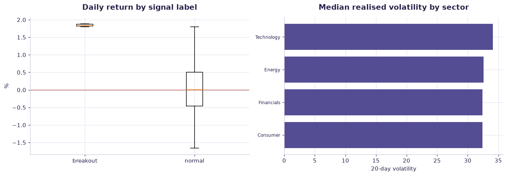

# Market signals — finance case study — worked solution

[](https://colab.research.google.com/github/RGarancs/applied-ai-academy-labs/blob/main/solutions/financemkt.ipynb) &nbsp; [← back to the problem set](../financemkt.ipynb)

**2,600 rows** · `finance_market.csv`

> Every number and chart below is the real output of the code shown.
> Try the problems yourself first — the point is the attempt, not the answer.

---

## Setup

<details><summary>Output</summary>

```
Shape: (2600, 10)
          trading_date ticker      sector  close_price  daily_return_pct   volume  market_cap_bn  pe_ratio  \
0  2025-01-01T00:00:00   AAPL  Technology       307.52            -0.313  5770858         908.87      59.4   
1  2025-01-02T00:00:00   AAPL  Technology       310.11             0.843  4932300        3672.27      56.2   
2  2025-01-03T00:00:00   AAPL  Technology       312.14             0.653  1312197        1421.36      27.0   
3  2025-01-04T00:00:00   AAPL  Technology       311.15            -0.318  7856265        1049.46      10.1   
4  2025-01-05T00:00:00   AAPL  Technology       313.41             0.728   957524        1961.02      23.2   

   realized_volatility_20d signal_label  
0                    33.69       normal  
1                    32.71       normal  
2                    31.02       normal  
3                    30.85       normal  
4                    36.18       normal
```

</details>

## What is in the file

```python
print("Columns and types:")
print(df.dtypes.to_string())
miss = df.isna().sum()
miss = miss[miss > 0]
print("\nMissing values:" if len(miss) else "\nNo missing values.")
if len(miss): print(miss.to_string())
```

<details><summary>Output</summary>

```
Columns and types:
trading_date                   str
ticker                         str
sector                         str
close_price                float64
daily_return_pct           float64
volume                       int64
market_cap_bn              float64
pe_ratio                   float64
realized_volatility_20d    float64
signal_label                   str

No missing values.
```

</details>

## Problem 1 · Easy — describe

What fraction of days are "breakout"? Compare average realised volatility for normal vs breakout days. Why is "predict normal always" already ~99% accurate?

*Try it yourself first. The worked solution is below.*

```python
df["trading_date"] = pd.to_datetime(df["trading_date"], errors="coerce")
print(f"Rows: {len(df):,}  Tickers: {df['ticker'].nunique()}  "
      f"Dates: {df['trading_date'].min().date()} to {df['trading_date'].max().date()}")
print("\nBy sector:")
print(df.groupby("sector").agg(rows=("ticker","size"),
                               mean_daily_return=("daily_return_pct","mean"),
                               mean_vol=("realized_volatility_20d","mean")).round(3))
print("\nSignal labels:\n", df["signal_label"].value_counts())
```

<details><summary>Output</summary>

```
Rows: 2,600  Tickers: 10  Dates: 2025-01-01 to 2025-12-18

By sector:
            rows  mean_daily_return  mean_vol
sector                                       
Consumer     260              0.051    32.497
Energy       260             -0.016    32.558
Financials   260              0.024    32.338
Technology  1820              0.046    40.279

Signal labels:
 signal_label
normal      2586
breakout      14
Name: count, dtype: int64
```

</details>

## Problem 2 · Intermediate — build

Frame breakout detection as anomaly detection. Which features (volatility, volume, return) flag breakouts? Build precision/recall — accuracy is banned here, and explain why to a risk officer.

*Try it yourself first. The worked solution is below.*

```python
print("Daily return by signal label (%):")
print(df.groupby("signal_label")["daily_return_pct"]
        .agg(n="size", mean="mean", median="median", std="std").round(3))
print("\nVolatility by sector:")
print(df.groupby("sector")["realized_volatility_20d"].median().round(3).sort_values(ascending=False))
print(f"\nCorrelation P/E vs forward return: "
      f"{df['pe_ratio'].corr(df['daily_return_pct']):.3f}  <-- near zero, as expected")
```

<details><summary>Output</summary>

```
Daily return by signal label (%):
                 n   mean  median    std
signal_label                            
breakout        14  1.838   1.826  0.028
normal        2586  0.029   0.009  0.638

Volatility by sector:
sector
Technology    34.110
Energy        32.575
Financials    32.400
Consumer      32.385
Name: realized_volatility_20d, dtype: float64

Correlation P/E vs forward return: -0.001  <-- near zero, as expected
```

</details>

## Problem 3 · Advanced — judge

Design the control-aware finance workflow: model -> evidence trail -> human sign-off before any action, plus model-risk monitoring. Explain the EU AI Act / model-risk angle: this is decision-support, not autonomous trading.

*Try it yourself first. The worked solution is below.*

```python
import numpy as np
d = df.dropna(subset=["daily_return_pct"]).copy()
mean_r = d["daily_return_pct"].mean()
print(f"Mean daily return across the panel: {mean_r:.4f}%")
print(f"Annualised (x252):                  {mean_r*252:.2f}%")
print(f"Daily volatility:                   {d['daily_return_pct'].std():.3f}%")
sharpe = (mean_r/d['daily_return_pct'].std())*np.sqrt(252)
print(f"Naive Sharpe:                       {sharpe:.2f}")
print("""
Why you must not trade on this
  · a single panel with no transaction costs, slippage or borrow costs
  · signal labels were constructed in hindsight — that is look-ahead bias
  · survivorship: only tickers that still exist appear here
  · this notebook is for teaching evaluation discipline, NOT investment advice
""")
```

<details><summary>Output</summary>

```
Mean daily return across the panel: 0.0383%
Annualised (x252):                  9.65%
Daily volatility:                   0.650%
Naive Sharpe:                       0.94

Why you must not trade on this
  · a single panel with no transaction costs, slippage or borrow costs
  · signal labels were constructed in hindsight — that is look-ahead bias
  · survivorship: only tickers that still exist appear here
  · this notebook is for teaching evaluation discipline, NOT investment advice
```

</details>

## Visual summary

The same answers, as pictures. These are what to project — a room reads a chart
far faster than it reads a table, and the shape of a result is usually the
argument you are actually making.

```python
fig, ax = plt.subplots(1, 2, figsize=(12.5, 4.4))
groups = [g["daily_return_pct"].dropna().values for _, g in df.groupby("signal_label")]
names = list(df.groupby("signal_label").groups.keys())
ax[0].boxplot(groups, showfliers=False)          # 'labels=' was renamed in mpl 3.9
ax[0].set_xticks(range(1, len(names) + 1)); ax[0].set_xticklabels(names)
ax[0].axhline(0, color=DANGER, lw=1)
ax[0].set_title("Daily return by signal label"); ax[0].set_ylabel("%")

v = df.groupby("sector")["realized_volatility_20d"].median().sort_values()
ax[1].barh(v.index, v.values, color=ACCENT)
ax[1].set_title("Median realised volatility by sector"); ax[1].set_xlabel("20-day volatility")
ax[1].tick_params(axis="y", labelsize=8)
plt.tight_layout(); plt.show()
```



<details><summary>Output</summary>

```
findfont: Failed to find font weight 600, now using 700.
```

</details>

## Verified answer key

These are the numbers the academy ships for this dataset. They were computed
from this exact file — if your run disagrees, reconcile before teaching it.

1. Only 14 of 2,600 days are "breakout" (0.5%) — the definition of an imbalanced, rare-event problem
2. Breakout days have clearly higher volatility (avg 59.8 vs 37.8) — the signal is real but rare
3. Accuracy is worthless here (99.5% by predicting "normal"); precision/recall + cost of a missed breakout are the metrics
4. Finance-control lesson: this flags, humans decide — source-linked evidence and sign-off, never auto-execution

## Teaching notes

* **Run the Easy problem live.** It sets the shared vocabulary and gets everyone
  looking at the same rows.
* **Let them fail on the Intermediate one.** The productive mistake is usually
  reaching for a model before checking the data.
* **Argue about the Advanced one.** It has no single right answer; it has a
  defensible one, and defending it is the skill being taught.
* **Always close on limitations.** Every dataset here has a real caveat —
  scrape bias, a tiny sample, a hindsight label. Naming it is the lesson.
* **Deliverable for learners:** Your 3-task comparison table + routing rule (Builder+: the validator design).

---
*Applied AI Academy · appliedai.center*

---

*Applied AI Academy · [appliedai.center](https://appliedai.center)*
