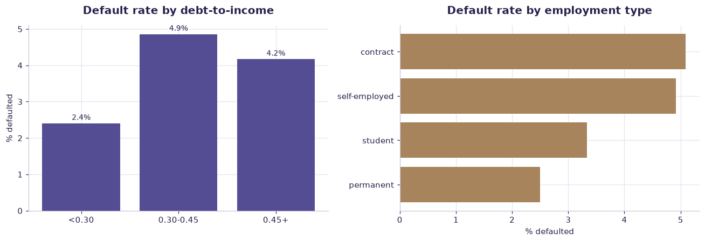

# Loan risk (synthetic) — worked solution

[](https://colab.research.google.com/github/RGarancs/applied-ai-academy-labs/blob/main/solutions/loans.ipynb) &nbsp; [← back to the problem set](../loans.ipynb)

**300 rows** · `loan_risk_synthetic.csv`

> Every number and chart below is the real output of the code shown.
> Try the problems yourself first — the point is the attempt, not the answer.

---

## Setup

<details><summary>Output</summary>

```
Shape: (300, 9)
  applicant_id  income  debt_to_income  credit_history_years  previous_defaults  loan_amount employment_type  \
0        A0001   34308            0.36                    24                  0        78324       permanent   
1        A0002   44083            0.50                     2                  2        42599         student   
2        A0003   21665            0.39                     7                  1        34941         student   
3        A0004   62372            0.44                    22                  1        59511   self-employed   
4        A0005   29832            0.55                     5                  1        13209         student   

   approved  defaulted  
0         1          0  
1         0          0  
2         0          0  
3         1          0  
4         0          0
```

</details>

## What is in the file

```python
print("Columns and types:")
print(df.dtypes.to_string())
miss = df.isna().sum()
miss = miss[miss > 0]
print("\nMissing values:" if len(miss) else "\nNo missing values.")
if len(miss): print(miss.to_string())
```

<details><summary>Output</summary>

```
Columns and types:
applicant_id                str
income                    int64
debt_to_income          float64
credit_history_years      int64
previous_defaults         int64
loan_amount               int64
employment_type             str
approved                  int64
defaulted                 int64

No missing values.
```

</details>

## Problem 1 · Easy — describe

What are the approval and default rates, and how do they interact?

*Try it yourself first. The worked solution is below.*

```python
print(f"Applications: {len(df)}")
print(f"Approved:     {df['approved'].mean():.1%}")
print(f"Defaulted:    {df['defaulted'].mean():.1%}  (of all applicants)")
appr = df[df["approved"] == 1]
print(f"Default rate AMONG APPROVED: {appr['defaulted'].mean():.1%}")
print("\nNote: you only ever observe repayment for people you approved —")
print("that is selection bias, and it is the whole difficulty of credit data.")
```

<details><summary>Output</summary>

```
Applications: 300
Approved:     66.3%
Defaulted:    3.7%  (of all applicants)
Default rate AMONG APPROVED: 5.5%

Note: you only ever observe repayment for people you approved —
that is selection bias, and it is the whole difficulty of credit data.
```

</details>

## Problem 2 · Intermediate — build

Which applicant features actually carry default risk?

*Try it yourself first. The worked solution is below.*

```python
num = ["income","debt_to_income","credit_history_years","previous_defaults","loan_amount"]
comp = df.groupby("defaulted")[num].mean().T
comp.columns = ["repaid","defaulted"]
comp["gap_%"] = ((comp["defaulted"] - comp["repaid"]) / comp["repaid"] * 100).round(1)
print(comp.round(2))
print("\nDefault rate by employment type:")
print((df.groupby("employment_type")["defaulted"].agg(n="size", rate="mean")
         .assign(rate=lambda d: (d["rate"]*100).round(1))))
```

<details><summary>Output</summary>

```
                        repaid  defaulted  gap_%
income                44696.84   44455.82   -0.5
debt_to_income            0.34       0.40   17.6
credit_history_years     12.61      15.91   26.2
previous_defaults         0.57       0.36  -35.9
loan_amount           41336.57   44675.45    8.1

Default rate by employment type:
                   n  rate
employment_type           
contract          59   5.1
permanent        120   2.5
self-employed     61   4.9
student           60   3.3
```

</details>

## Problem 3 · Advanced — judge

Build a risk model — then show why accuracy is the wrong headline.

*Try it yourself first. The worked solution is below.*

```python
from sklearn.ensemble import RandomForestClassifier
from sklearn.model_selection import train_test_split
from sklearn.metrics import roc_auc_score, confusion_matrix, accuracy_score

X = pd.get_dummies(df[["income","debt_to_income","credit_history_years",
                       "previous_defaults","loan_amount","employment_type"]], drop_first=True)
y = df["defaulted"]
Xtr, Xte, ytr, yte = train_test_split(X, y, test_size=.3, random_state=42, stratify=y)
m = RandomForestClassifier(n_estimators=300, random_state=42).fit(Xtr, ytr)
p = m.predict_proba(Xte)[:, 1]

print(f"Accuracy of 'approve everyone': {1 - yte.mean():.1%}   <-- the naive baseline")
print(f"Model accuracy:                 {accuracy_score(yte, (p>=.5).astype(int)):.1%}")
print(f"Model AUC:                      {roc_auc_score(yte, p):.3f}   <-- the honest metric")

imp = pd.Series(m.feature_importances_, index=X.columns).sort_values(ascending=False)
print("\nTop features:\n", imp.head(6).round(3))
print("\nWith a rare outcome, accuracy rewards predicting 'no default' every time.")
```

<details><summary>Output</summary>

```
Accuracy of 'approve everyone': 96.7%   <-- the naive baseline
Model accuracy:                 96.7%
Model AUC:                      0.454   <-- the honest metric

Top features:
 debt_to_income               0.233
loan_amount                  0.232
income                       0.226
credit_history_years         0.172
previous_defaults            0.045
employment_type_permanent    0.035
dtype: float64

With a rare outcome, accuracy rewards predicting 'no default' every time.
```

</details>

## Visual summary

The same answers, as pictures. These are what to project — a room reads a chart
far faster than it reads a table, and the shape of a result is usually the
argument you are actually making.

```python
fig, ax = plt.subplots(1, 2, figsize=(12, 4.2))
band = pd.cut(df["debt_to_income"], [0,.30,.45,1], labels=["<0.30","0.30-0.45","0.45+"])
r = df.groupby(band, observed=True)["defaulted"].mean().mul(100)
ax[0].bar(r.index.astype(str), r.values, color=ACCENT)
ax[0].set_title("Default rate by debt-to-income"); ax[0].set_ylabel("% defaulted")
for i, v in enumerate(r.values): ax[0].text(i, v + .1, f"{v:.1f}%", ha="center", fontsize=9)

r2 = df.groupby("employment_type")["defaulted"].mean().mul(100).sort_values()
ax[1].barh(r2.index, r2.values, color=BUILDER)
ax[1].set_title("Default rate by employment type"); ax[1].set_xlabel("% defaulted")
plt.tight_layout(); plt.show()
```



<details><summary>Output</summary>

```
findfont: Failed to find font weight 600, now using 700.
```

</details>

## Verified answer key

These are the numbers the academy ships for this dataset. They were computed
from this exact file — if your run disagrees, reconcile before teaching it.

1. Approval rate 66.3% (199/300); default among approved 5.5%
2. Default by DTI band: <0.30 → 3.0% · 0.30–0.45 → 7.8% · ≥0.45 → 8.8%
3. Approved applicants with previous defaults: 9.1% default rate
4. Selection bias: defaults observed only among approved — the classic credit trap

## Teaching notes

* **Run the Easy problem live.** It sets the shared vocabulary and gets everyone
  looking at the same rows.
* **Let them fail on the Intermediate one.** The productive mistake is usually
  reaching for a model before checking the data.
* **Argue about the Advanced one.** It has no single right answer; it has a
  defensible one, and defending it is the skill being taught.
* **Always close on limitations.** Every dataset here has a real caveat —
  scrape bias, a tiny sample, a hindsight label. Naming it is the lesson.
* **Deliverable for learners:** Control-aware finance AI workflow diagram + risk classification of the five automations.

---
*Applied AI Academy · appliedai.center*

---

*Applied AI Academy · [appliedai.center](https://appliedai.center)*
