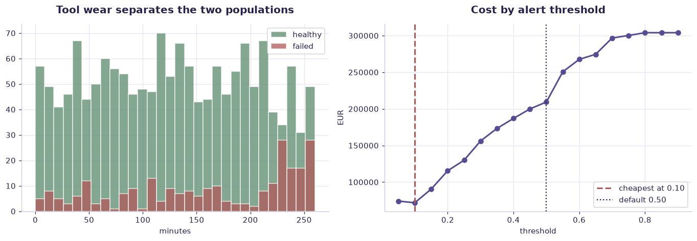

# Predictive maintenance (operations case study) — worked solution

[](https://colab.research.google.com/github/RGarancs/applied-ai-academy-labs/blob/main/solutions/maintenance.ipynb) &nbsp; [← back to the problem set](../maintenance.ipynb)

**1,800 rows** · `manufacturing_maintenance.csv`

> Every number and chart below is the real output of the code shown.
> Try the problems yourself first — the point is the attempt, not the answer.

---

## Setup

<details><summary>Output</summary>

```
Shape: (1800, 15)
   event_id            timestamp        plant   machine_id product_quality_tier  air_temp_k  process_temp_k  \
0  MF000001  2026-01-01T00:00:00  Tartu Plant     PRESS-19                    H       300.2           308.9   
1  MF000002  2026-01-02T00:00:00   Riga Plant  PACKAGER-06                    M       309.6           319.4   
2  MF000003  2026-01-03T00:00:00  Tartu Plant     LATHE-20                    H       305.7           317.3   
3  MF000004  2026-01-04T00:00:00   Riga Plant  CONVEYOR-19                    L       313.5           325.7   
4  MF000005  2026-01-05T00:00:00   Riga Plant     PRESS-19                    L       301.9           314.2   

   rotational_speed_rpm  torque_nm  tool_wear_min  vibration_mm_s  power_kw  failure_flag failure_mode  downtime_min  
0                  1936       60.4            232            1.50     12.25         False         none             0  
1                  1709       70.7            164            0.37     12.65         False         none             0  
2                  2432       69.5             99            1.55     17.70         False         none             0  
3                  1887       52.7            179            1.17     10.41         False         none             0  
4                  1281       40.3             30            2.49      5.41         False         none             0
```

</details>

## What is in the file

```python
print("Columns and types:")
print(df.dtypes.to_string())
miss = df.isna().sum()
miss = miss[miss > 0]
print("\nMissing values:" if len(miss) else "\nNo missing values.")
if len(miss): print(miss.to_string())
```

<details><summary>Output</summary>

```
Columns and types:
event_id                    str
timestamp                   str
plant                       str
machine_id                  str
product_quality_tier        str
air_temp_k              float64
process_temp_k          float64
rotational_speed_rpm      int64
torque_nm               float64
tool_wear_min             int64
vibration_mm_s          float64
power_kw                float64
failure_flag               bool
failure_mode                str
downtime_min              int64

No missing values.
```

</details>

## Problem 1 · Easy — describe

What is the overall failure rate? Compare average tool_wear, torque, and vibration for failed vs healthy events. Which reading separates them most?

*Try it yourself first. The worked solution is below.*

```python
print(f"Events: {len(df):,}   Machines: {df['machine_id'].nunique()}   Plants: {df['plant'].nunique()}")
print(f"Failure rate: {df['failure_flag'].mean():.2%}")
print("\nFailure modes:\n", df[df.failure_flag]["failure_mode"].value_counts())
print("\nDowntime when a failure happens (minutes):")
print(df[df.failure_flag]["downtime_min"].describe().round(1))
```

<details><summary>Output</summary>

```
Events: 1,800   Machines: 168   Plants: 3
Failure rate: 14.00%

Failure modes:
 failure_mode
tool_wear     96
overstrain    77
heat          54
power         25
Name: count, dtype: int64

Downtime when a failure happens (minutes):
count    252.0
mean     157.9
std       81.1
min       21.0
25%       89.0
50%      157.5
75%      227.0
max      297.0
Name: downtime_min, dtype: float64
```

</details>

## Problem 2 · Intermediate — build

Train a failure classifier. Build the confusion matrix. A false alarm costs €200 (needless inspection); a missed failure costs €5,000 (breakdown). Choose the threshold that minimises expected cost.

*Try it yourself first. The worked solution is below.*

```python
sensors = ["air_temp_k","process_temp_k","rotational_speed_rpm","torque_nm",
           "tool_wear_min","vibration_mm_s","power_kw"]
comp = df.groupby("failure_flag")[sensors].mean().T
comp.columns = ["healthy","failed"]
comp["gap_%"] = ((comp["failed"]-comp["healthy"])/comp["healthy"]*100).round(1)
print(comp.round(2).sort_values("gap_%", key=abs, ascending=False))
print("\nTool wear at failure vs healthy — the classic maintenance signal.")
```

<details><summary>Output</summary>

```
                      healthy   failed  gap_%
vibration_mm_s           1.69     2.18   29.2
tool_wear_min          127.79   160.77   25.8
torque_nm               47.54    50.38    6.0
power_kw                 9.24     9.60    4.0
rotational_speed_rpm  1854.35  1834.32   -1.1
air_temp_k             305.45   306.75    0.4
process_temp_k         315.45   316.72    0.4

Tool wear at failure vs healthy — the classic maintenance signal.
```

</details>

## Problem 3 · Advanced — judge

Design the predictive-maintenance workflow: which alerts auto-schedule a check, which page a human, and what the model monitoring plan is (sensor drift, seasonal load). Explain why 96% accuracy can still be a bad model here (imbalanced classes).

*Try it yourself first. The worked solution is below.*

```python
from sklearn.ensemble import RandomForestClassifier
from sklearn.model_selection import train_test_split
from sklearn.metrics import roc_auc_score, recall_score, precision_score

sensors = ["air_temp_k","process_temp_k","rotational_speed_rpm","torque_nm",
           "tool_wear_min","vibration_mm_s","power_kw"]
X, y = df[sensors], df["failure_flag"].astype(int)
Xtr, Xte, ytr, yte = train_test_split(X, y, test_size=.3, random_state=42, stratify=y)
m = RandomForestClassifier(n_estimators=300, random_state=42,
                           class_weight="balanced", n_jobs=-1).fit(Xtr, ytr)
p = m.predict_proba(Xte)[:,1]
print(f"AUC: {roc_auc_score(yte, p):.3f}\n")

# A missed failure costs far more than a needless inspection: tune for recall.
COST_INSPECT, COST_FAILURE = 120, 4000
print("thresh  alerts  caught  missed  recall  precision   cost_EUR")
best = None
for t in [.1,.2,.3,.4,.5,.6,.7]:
    pred = (p >= t).astype(int)
    caught = int(((pred==1)&(yte==1)).sum()); missed = int(((pred==0)&(yte==1)).sum())
    cost = pred.sum()*COST_INSPECT + missed*COST_FAILURE
    print(f"  {t:.1f}   {pred.sum():5d}  {caught:5d}  {missed:5d}   "
          f"{recall_score(yte,pred):.2f}     {precision_score(yte,pred,zero_division=0):.2f}   {cost:8,.0f}")
    if best is None or cost < best[1]: best = (t, cost)
print(f"\nCost-optimal threshold: {best[0]} (EUR {best[1]:,.0f}).")
print("Note it is NOT 0.5 — the default threshold is an arbitrary choice.")
```

<details><summary>Output</summary>

```
AUC: 0.701

thresh  alerts  caught  missed  recall  precision   cost_EUR
  0.1     398     70      6   0.92     0.18     71,760
  0.2     262     55     21   0.72     0.21    115,440
  0.3     171     44     32   0.58     0.26    148,520
  0.4     124     33     43   0.43     0.27    186,880
  0.5      78     26     50   0.34     0.33    209,360
  0.6      31     10     66   0.13     0.32    267,720
  0.7       8      3     73   0.04     0.38    292,960

Cost-optimal threshold: 0.1 (EUR 71,760).
Note it is NOT 0.5 — the default threshold is an arbitrary choice.
```

</details>

## Visual summary

The same answers, as pictures. These are what to project — a room reads a chart
far faster than it reads a table, and the shape of a result is usually the
argument you are actually making.

```python
from sklearn.ensemble import RandomForestClassifier
from sklearn.model_selection import train_test_split
sensors = ["air_temp_k","process_temp_k","rotational_speed_rpm","torque_nm","tool_wear_min","vibration_mm_s","power_kw"]
X, y = df[sensors], df["failure_flag"].astype(int)
Xtr, Xte, ytr, yte = train_test_split(X, y, test_size=.3, random_state=42, stratify=y)
m = RandomForestClassifier(n_estimators=300, random_state=42, class_weight="balanced", n_jobs=-1).fit(Xtr, ytr)
p = m.predict_proba(Xte)[:, 1]

fig, ax = plt.subplots(1, 2, figsize=(12.5, 4.4))
ax[0].hist(df[~df.failure_flag]["tool_wear_min"], bins=30, alpha=.75, label="healthy", color=CORE, edgecolor="white")
ax[0].hist(df[df.failure_flag]["tool_wear_min"], bins=30, alpha=.75, label="failed", color=DANGER, edgecolor="white")
ax[0].set_title("Tool wear separates the two populations"); ax[0].set_xlabel("minutes"); ax[0].legend()

C_INSPECT, C_FAIL = 120, 4000
ts = np.arange(.05, .95, .05)
costs = [( (p>=t).sum()*C_INSPECT + ((p<t)&(yte==1)).sum()*C_FAIL ) for t in ts]
ax[1].plot(ts, costs, marker="o", color=ACCENT, lw=2)
best = ts[int(np.argmin(costs))]
ax[1].axvline(best, color=DANGER, ls="--", lw=2, label=f"cheapest at {best:.2f}")
ax[1].axvline(.5, color=INK, ls=":", lw=1.5, label="default 0.50")
ax[1].set_title("Cost by alert threshold"); ax[1].set_xlabel("threshold"); ax[1].set_ylabel("EUR"); ax[1].legend()
plt.tight_layout(); plt.show()
```



<details><summary>Output</summary>

```
findfont: Failed to find font weight 600, now using 700.
```

</details>

## Verified answer key

These are the numbers the academy ships for this dataset. They were computed
from this exact file — if your run disagrees, reconcile before teaching it.

1. Failure rate 14.0% — imbalanced, so accuracy is misleading; use precision/recall + cost-weighting
2. Tool wear is the strongest signal: failed events average 161 min vs 128 min healthy
3. Threshold is an economics decision: €200 false-alarm vs €5,000 missed-failure -> favour recall (catch failures)
4. Operations lesson: the model is the easy part; the alert workflow, human checkpoints, and drift monitoring are the real work

## Teaching notes

* **Run the Easy problem live.** It sets the shared vocabulary and gets everyone
  looking at the same rows.
* **Let them fail on the Intermediate one.** The productive mistake is usually
  reaching for a model before checking the data.
* **Argue about the Advanced one.** It has no single right answer; it has a
  defensible one, and defending it is the skill being taught.
* **Always close on limitations.** Every dataset here has a real caveat —
  scrape bias, a tiny sample, a hindsight label. Naming it is the lesson.
* **Deliverable for learners:** The Sense→Predict→Schedule→Verify→Learn design for one industrial process.

---
*Applied AI Academy · appliedai.center*

---

*Applied AI Academy · [appliedai.center](https://appliedai.center)*
