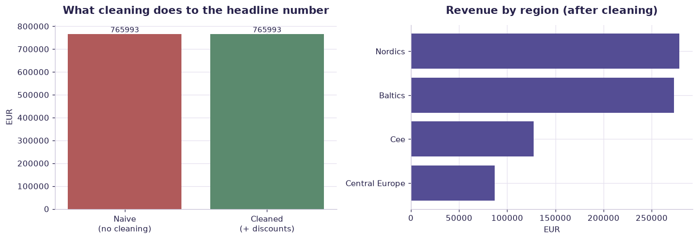

# Messy sales data (synthetic) — worked solution

[](https://colab.research.google.com/github/RGarancs/applied-ai-academy-labs/blob/main/solutions/messy.ipynb) &nbsp; [← back to the problem set](../messy.ipynb)

**260 rows** · `messy_sales_data.csv`

> Every number and chart below is the real output of the code shown.
> Try the problems yourself first — the point is the attempt, not the answer.

---

## Setup

<details><summary>Output</summary>

```
Shape: (260, 8)
         date    region     product    units  unit_price  discount_pct sales_rep    notes
0  2026-01-12   baltics     Premium       48      196.38          10.0       NaN  renewal
1  2026-09-25   Nordics        Core  missing      120.62           NaN     Marta      NaN
2  2026-01-25       CEE  Enterprise       20       78.37           0.0       NaN  renewal
3    3/5/2026   Nordics     service       27      118.51           NaN      Lina      NaN
4  2026-02-17  Nordics         Core       38      202.23           0.0     Marta  renewal
```

</details>

## What is in the file

```python
print("Columns and types:")
print(df.dtypes.to_string())
miss = df.isna().sum()
miss = miss[miss > 0]
print("\nMissing values:" if len(miss) else "\nNo missing values.")
if len(miss): print(miss.to_string())
```

<details><summary>Output</summary>

```
Columns and types:
date                str
region              str
product             str
units               str
unit_price      float64
discount_pct    float64
sales_rep           str
notes               str

Missing values:
discount_pct    47
sales_rep       40
notes           54
```

</details>

## Problem 1 · Easy — describe

Find every data-quality problem before computing anything.

*Try it yourself first. The worked solution is below.*

```python
print("Shape:", df.shape)
print("\nMissing values per column:\n", df.isna().sum())
print("\n'units' is stored as text — look why:")
print(df["units"].astype(str).str.strip().value_counts().head(12))
print("\nRegion spellings:", sorted(df["region"].dropna().unique().tolist()))
print("Product spellings:", sorted(df["product"].dropna().unique().tolist())[:12])
print("\nDuplicate rows:", df.duplicated().sum())
```

<details><summary>Output</summary>

```
Shape: (260, 8)

Missing values per column:
 date             0
region           0
product          0
units            0
unit_price       0
discount_pct    47
sales_rep       40
notes           54
dtype: int64

'units' is stored as text — look why:
units
missing    10
4          10
37         10
48          9
25          9
31          9
44          8
33          8
10          8
27          7
36          7
43          7
Name: count, dtype: int64

Region spellings: ['Baltics', 'CEE', 'Central Europe', 'Nordics', 'Nordics ', 'baltics']
Product spellings: ['Core', 'Enterprise', 'Premium', 'Service', 'service']

Duplicate rows: 0
```

</details>

## Problem 2 · Intermediate — build

Clean it, and state every decision you made.

*Try it yourself first. The worked solution is below.*

```python
c = df.copy()

# 1. units: strip text, coerce to number, drop what cannot be salvaged
c["units_clean"] = pd.to_numeric(
    c["units"].astype(str).str.replace(r"[^0-9.\-]", "", regex=True).replace("", None),
    errors="coerce")

# 2. region / product: collapse casing and whitespace variants
c["region_clean"] = c["region"].astype(str).str.strip().str.title()
c["product_clean"] = c["product"].astype(str).str.strip().str.title()

# 3. dates: parse, keep failures visible
c["date_clean"] = pd.to_datetime(c["date"], errors="coerce", dayfirst=False)

# 4. discount: treat impossible values as missing rather than silently keeping them
c["discount_clean"] = c["discount_pct"].where(c["discount_pct"].between(0, 1))

print("Rows lost to unparseable units:", c["units_clean"].isna().sum())
print("Rows lost to unparseable dates:", c["date_clean"].isna().sum())
print("Impossible discounts blanked:  ", (c["discount_pct"].notna() & c["discount_clean"].isna()).sum())
print("\nRegions after cleaning:", sorted(c["region_clean"].unique().tolist()))
```

<details><summary>Output</summary>

```
Rows lost to unparseable units: 10
Rows lost to unparseable dates: 14
Impossible discounts blanked:   129

Regions after cleaning: ['Baltics', 'Cee', 'Central Europe', 'Nordics']
```

</details>

## Problem 3 · Advanced — judge

Now compute revenue — and show how wrong the naive number was.

*Try it yourself first. The worked solution is below.*

```python
c["revenue"] = c["units_clean"] * c["unit_price"] * (1 - c["discount_clean"].fillna(0))
total = c["revenue"].sum()
print(f"Total revenue (cleaned): EUR {total:,.0f}")

naive = pd.to_numeric(df["units"], errors="coerce") * df["unit_price"]
print(f"Naive total (no cleaning, no discount): EUR {naive.sum():,.0f}")
print(f"Difference: EUR {naive.sum() - total:,.0f}")

print("\nRevenue by region:")
print(c.groupby("region_clean")["revenue"].sum().sort_values(ascending=False).round(0))
print("\nEvery cleaning decision above changes this number. Document them.")
```

<details><summary>Output</summary>

```
Total revenue (cleaned): EUR 765,993
Naive total (no cleaning, no discount): EUR 765,993
Difference: EUR 0

Revenue by region:
region_clean
Nordics           278605.0
Baltics           272948.0
Cee               127531.0
Central Europe     86909.0
Name: revenue, dtype: float64

Every cleaning decision above changes this number. Document them.
```

</details>

## Visual summary

The same answers, as pictures. These are what to project — a room reads a chart
far faster than it reads a table, and the shape of a result is usually the
argument you are actually making.

```python
c = df.copy()
c["units_clean"] = pd.to_numeric(c["units"].astype(str).str.replace(r"[^0-9.\-]", "", regex=True).replace("", None), errors="coerce")
c["discount_clean"] = c["discount_pct"].where(c["discount_pct"].between(0, 1))
c["region_clean"] = c["region"].astype(str).str.strip().str.title()
c["revenue"] = c["units_clean"] * c["unit_price"] * (1 - c["discount_clean"].fillna(0))
naive = pd.to_numeric(df["units"], errors="coerce") * df["unit_price"]

fig, ax = plt.subplots(1, 2, figsize=(12, 4.2))
vals = [naive.sum(), c["revenue"].sum()]
b = ax[0].bar(["Naive\n(no cleaning)", "Cleaned\n(+ discounts)"], vals, color=[DANGER, CORE])
ax[0].set_title("What cleaning does to the headline number"); ax[0].set_ylabel("EUR")
ax[0].bar_label(b, fmt="%.0f", fontsize=9)

reg = c.groupby("region_clean")["revenue"].sum().sort_values()
ax[1].barh(reg.index, reg.values, color=ACCENT)
ax[1].set_title("Revenue by region (after cleaning)"); ax[1].set_xlabel("EUR")
plt.tight_layout(); plt.show()
```



<details><summary>Output</summary>

```
findfont: Failed to find font weight 600, now using 700.
```

</details>

## Verified answer key

These are the numbers the academy ships for this dataset. They were computed
from this exact file — if your run disagrees, reconcile before teaching it.

1. Region spellings: baltics(45)/Baltics(41) · CEE(52)/Central Europe(35) · Nordics(87)
2. 40 missing reps · 10 "missing" units · 47 "n/a" discounts · 14 malformed dates
3. No exact duplicate rows (verify, don't assume)
4. Net revenue on the 250 clean-computable rows ≈ €728,000

## Teaching notes

* **Run the Easy problem live.** It sets the shared vocabulary and gets everyone
  looking at the same rows.
* **Let them fail on the Intermediate one.** The productive mistake is usually
  reaching for a model before checking the data.
* **Argue about the Advanced one.** It has no single right answer; it has a
  defensible one, and defending it is the skill being taught.
* **Always close on limitations.** Every dataset here has a real caveat —
  scrape bias, a tiny sample, a hindsight label. Naming it is the lesson.
* **Deliverable for learners:** Data readiness scorecard v1 + your cleaning decision log.

---
*Applied AI Academy · appliedai.center*

---

*Applied AI Academy · [appliedai.center](https://appliedai.center)*
