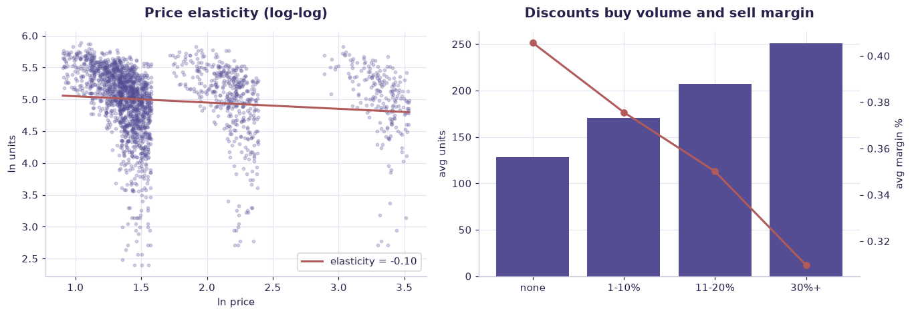

# Pricing & promotion — marketing case study — worked solution

[](https://colab.research.google.com/github/RGarancs/applied-ai-academy-labs/blob/main/solutions/pricingpromo.ipynb) &nbsp; [← back to the problem set](../pricingpromo.ipynb)

**2,200 rows** · `pricing_promo.csv`

> Every number and chart below is the real output of the code shown.
> Try the problems yourself first — the point is the attempt, not the answer.

---

## Setup

<details><summary>Output</summary>

```
Shape: (2200, 16)
    week_id            store      sku          product     category shelf_position  regular_price_eur  net_price_eur  \
0  2026-W01  Berlin Flagship  SKU2001      protein bar      Grocery      eye_level                4.2           3.31   
1  2026-W02   Helsinki Local  SKU2002      laundry gel    Household      eye_level                4.2           2.96   
2  2026-W03     Riga Central  SKU2005       toothpaste       Health            top                9.5           9.27   
3  2026-W04    Vilnius North  SKU2007   wireless mouse  Electronics         endcap               29.9          30.58   
4  2026-W05   Helsinki Local  SKU2003  sparkling water      Grocery      eye_level                4.2           3.46   

   discount_pct  competitor_price_eur  display_flag      promo_type  units_sold  revenue_eur  gross_margin_pct  \
0          0.20                  4.60         False       price_cut         209       691.79             0.328   
1          0.35                  3.74         False  loyalty_coupon         285       843.60             0.328   
2          0.00                  8.47         False            none         100       927.00             0.403   
3          0.00                 35.67         False            none         207      6330.06             0.411   
4          0.20                  3.85         False        multibuy         138       477.48             0.338   

   stockout_flag  
0          False  
1          False  
2           True  
3          False  
4          False
```

</details>

## What is in the file

```python
print("Columns and types:")
print(df.dtypes.to_string())
miss = df.isna().sum()
miss = miss[miss > 0]
print("\nMissing values:" if len(miss) else "\nNo missing values.")
if len(miss): print(miss.to_string())
```

<details><summary>Output</summary>

```
Columns and types:
week_id                     str
store                       str
sku                         str
product                     str
category                    str
shelf_position              str
regular_price_eur       float64
net_price_eur           float64
discount_pct            float64
competitor_price_eur    float64
display_flag               bool
promo_type                  str
units_sold                int64
revenue_eur             float64
gross_margin_pct        float64
stockout_flag              bool

No missing values.
```

</details>

## Problem 1 · Easy — describe

Do displayed items sell more than non-displayed? Does eye-level shelf position sell more than bottom? By how much? (Describe — do not conclude cause yet.)

*Try it yourself first. The worked solution is below.*

```python
print(f"Rows: {len(df):,}  Stores: {df['store'].nunique()}  SKUs: {df['sku'].nunique()}")
print(f"Total revenue: EUR {df['revenue_eur'].sum():,.0f}")
print("\nBy promo type:")
print(df.groupby("promo_type").agg(weeks=("units_sold","size"), units=("units_sold","sum"),
                                   revenue=("revenue_eur","sum"),
                                   margin=("gross_margin_pct","mean")).round(1))
```

<details><summary>Output</summary>

```
Rows: 2,200  Stores: 6  SKUs: 10
Total revenue: EUR 2,497,535

By promo type:
                weeks   units    revenue  margin
promo_type                                      
bundle            281   56922   345033.9     0.4
loyalty_coupon    280   54832   355674.9     0.4
multibuy          253   51421   336509.0     0.4
none             1100  140730  1074562.1     0.4
price_cut         286   56588   385755.0     0.4
```

</details>

## Problem 2 · Intermediate — build

Estimate price elasticity: how do units respond to discount_pct? Separate the discount effect from the display effect with a grouped comparison. Which promo_type gives the best lift per € of margin sacrificed?

*Try it yourself first. The worked solution is below.*

```python
d = df[(df.regular_price_eur>0) & (df.net_price_eur>0) & (df.units_sold>0)].copy()
import numpy as np
d["ln_p"], d["ln_q"] = np.log(d["net_price_eur"]), np.log(d["units_sold"])
el = np.polyfit(d["ln_p"], d["ln_q"], 1)[0]
print(f"Overall price elasticity: {el:.2f}")
print("(-1 means a 1% price cut buys a 1% volume rise; below -1 = elastic)")
print("\nElasticity by category:")
for c, g in d.groupby("category"):
    if len(g) > 60:
        print(f"  {c:<18} {np.polyfit(g['ln_p'], g['ln_q'], 1)[0]:+.2f}   (n={len(g)})")
```

<details><summary>Output</summary>

```
Overall price elasticity: -0.10
(-1 means a 1% price cut buys a 1% volume rise; below -1 = elastic)

Elasticity by category:
  Electronics        -1.67   (n=209)
  Grocery            -1.85   (n=1093)
  Health             -1.84   (n=427)
  Household          -1.74   (n=236)
  Stationery         -1.85   (n=235)
```

</details>

## Problem 3 · Advanced — judge

Argue the causation trap: displayed/discounted items may already be popular. Design an experiment (which SKUs, which stores, how long) that would ISOLATE the true promo effect — the thing this observational data cannot prove.

*Try it yourself first. The worked solution is below.*

```python
promo = df[df.discount_pct > 0]; base = df[df.discount_pct == 0]
print(f"Promo weeks:    units {promo.units_sold.mean():.1f}  margin {promo.gross_margin_pct.mean():.1f}%")
print(f"Non-promo weeks: units {base.units_sold.mean():.1f}  margin {base.gross_margin_pct.mean():.1f}%")

band = pd.cut(df["discount_pct"], [-.001,0,.1,.2,.3,1],
              labels=["none","1-10%","11-20%","21-30%","30%+"])
t = (df.groupby(band, observed=True)
       .agg(weeks=("units_sold","size"), units=("units_sold","mean"),
            revenue=("revenue_eur","mean"), margin=("gross_margin_pct","mean")).round(1))
print("\n", t)
print("\nDeep discounts move units and destroy margin. The question a pricing")
print("team must answer is whether the volume is INCREMENTAL or just pulled forward.")
```

<details><summary>Output</summary>

```
Promo weeks:    units 199.8  margin 0.4%
Non-promo weeks: units 127.9  margin 0.4%

               weeks  units  revenue  margin
discount_pct                               
none           1100  127.9    976.9     0.4
1-10%           461  170.8   1268.7     0.4
11-20%          440  207.0   1334.6     0.4
30%+            199  250.9   1260.5     0.3

Deep discounts move units and destroy margin. The question a pricing
team must answer is whether the volume is INCREMENTAL or just pulled forward.
```

</details>

## Visual summary

The same answers, as pictures. These are what to project — a room reads a chart
far faster than it reads a table, and the shape of a result is usually the
argument you are actually making.

```python
d = df[(df.net_price_eur > 0) & (df.units_sold > 0)].copy()
d["ln_p"], d["ln_q"] = np.log(d.net_price_eur), np.log(d.units_sold)
el = np.polyfit(d.ln_p, d.ln_q, 1)
fig, ax = plt.subplots(1, 2, figsize=(12.5, 4.4))
ax[0].scatter(d.ln_p, d.ln_q, s=8, alpha=.25, color=ACCENT)
xs = np.linspace(d.ln_p.min(), d.ln_p.max(), 50)
ax[0].plot(xs, np.polyval(el, xs), color=DANGER, lw=2, label=f"elasticity = {el[0]:.2f}")
ax[0].set_title("Price elasticity (log-log)"); ax[0].set_xlabel("ln price"); ax[0].set_ylabel("ln units"); ax[0].legend()

band = pd.cut(df["discount_pct"], [-.001,0,.1,.2,.3,1], labels=["none","1-10%","11-20%","21-30%","30%+"])
g = df.groupby(band, observed=True).agg(units=("units_sold","mean"), margin=("gross_margin_pct","mean"))
a2 = ax[1]; a3 = a2.twinx(); a3.grid(False)
a2.bar(g.index.astype(str), g["units"], color=ACCENT, label="units")
a3.plot(g.index.astype(str), g["margin"], color=DANGER, marker="o", lw=2, label="margin %")
a2.set_title("Discounts buy volume and sell margin"); a2.set_ylabel("avg units"); a3.set_ylabel("avg margin %")
plt.tight_layout(); plt.show()
```



<details><summary>Output</summary>

```
findfont: Failed to find font weight 600, now using 700.
```

</details>

## Verified answer key

These are the numbers the academy ships for this dataset. They were computed
from this exact file — if your run disagrees, reconcile before teaching it.

1. Displayed items sell ~196 units vs ~152 without — a real but confounded lift
2. The marketing trap: promoted & well-placed items were often already best-sellers (correlation != causation)
3. Elasticity is the intermediate skill; the advanced skill is designing the experiment observational data cannot replace
4. Ties directly to Lesson 11 causality trap and Lesson 12 "growth without eroding trust"

## Teaching notes

* **Run the Easy problem live.** It sets the shared vocabulary and gets everyone
  looking at the same rows.
* **Let them fail on the Intermediate one.** The productive mistake is usually
  reaching for a model before checking the data.
* **Argue about the Advanced one.** It has no single right answer; it has a
  defensible one, and defending it is the skill being taught.
* **Always close on limitations.** Every dataset here has a real caveat —
  scrape bias, a tiny sample, a hindsight label. Naming it is the lesson.


---
*Applied AI Academy · appliedai.center*

---

*Applied AI Academy · [appliedai.center](https://appliedai.center)*
