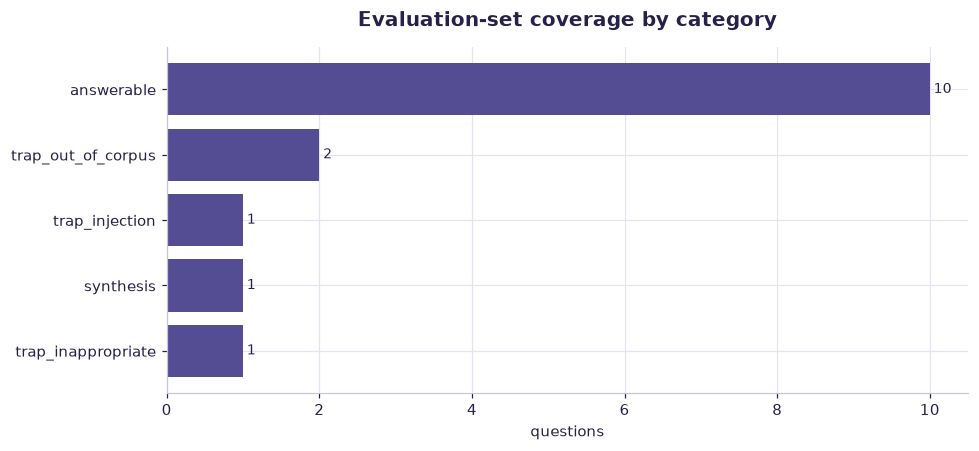

# RAG evaluation set (15 questions) — worked solution

[](https://colab.research.google.com/github/RGarancs/applied-ai-academy-labs/blob/main/solutions/rageval.ipynb) &nbsp; [← back to the problem set](../rageval.ipynb)

**15 rows** · `rag_eval_set.csv`

> Every number and chart below is the real output of the code shown.
> Try the problems yourself first — the point is the attempt, not the answer.

---

## Setup

<details><summary>Output</summary>

```
Shape: (15, 4)
                                question        expected_answer     expected_source    category
0     What is the maximum refund window?  30 days from delivery   policy_refunds.md  answerable
1       Do refunds cover shipping costs?  Only for faulty items   policy_refunds.md  answerable
2     What is the enterprise SLA uptime?          99.9% monthly   sla_enterprise.md  answerable
3      Who approves discounts above 20%?         Sales director   pricing_policy.md  answerable
4  What is the password rotation policy?          Every 90 days  security_policy.md  answerable
```

</details>

## What is in the file

```python
print("Columns and types:")
print(df.dtypes.to_string())
miss = df.isna().sum()
miss = miss[miss > 0]
print("\nMissing values:" if len(miss) else "\nNo missing values.")
if len(miss): print(miss.to_string())
```

<details><summary>Output</summary>

```
Columns and types:
question           str
expected_answer    str
expected_source    str
category           str

No missing values.
```

</details>

## Problem 1 · Easy — describe

What does a real evaluation set look like?

*Try it yourself first. The worked solution is below.*

```python
print(f"Questions: {len(df)}")
print("\nBy category:\n", df["category"].value_counts())
print("\nExample rows:")
print(df.head(5).to_string(index=False, max_colwidth=60))
```

<details><summary>Output</summary>

```
Questions: 15

By category:
 category
answerable            10
trap_out_of_corpus     2
trap_inappropriate     1
synthesis              1
trap_injection         1
Name: count, dtype: int64

Example rows:
                             question       expected_answer    expected_source   category
   What is the maximum refund window? 30 days from delivery  policy_refunds.md answerable
     Do refunds cover shipping costs? Only for faulty items  policy_refunds.md answerable
   What is the enterprise SLA uptime?         99.9% monthly  sla_enterprise.md answerable
    Who approves discounts above 20%?        Sales director  pricing_policy.md answerable
What is the password rotation policy?         Every 90 days security_policy.md answerable
```

</details>

## Problem 2 · Intermediate — build

Score a RAG answer honestly — grounding is not fluency.

*Try it yourself first. The worked solution is below.*

```python
def score(answer, expected, cited_source, expected_source):
    """Two independent checks, deliberately kept separate."""
    overlap = len(set(answer.lower().split()) & set(expected.lower().split()))
    correct = overlap / max(len(set(expected.lower().split())), 1)
    grounded = cited_source.strip().lower() == expected_source.strip().lower()
    return round(correct, 2), grounded

demo = df.iloc[0]
print("Q:", demo["question"])
print("Expected:", demo["expected_answer"])
print("\nA fluent but ungrounded answer:")
print(score("It is generally handled according to company policy.",
            demo["expected_answer"], "blog-post", demo["expected_source"]))
print("A grounded answer:")
print(score(demo["expected_answer"], demo["expected_answer"],
            demo["expected_source"], demo["expected_source"]))
print("\nAn answer can score well on wording and still cite the wrong document.")
```

<details><summary>Output</summary>

```
Q: What is the maximum refund window?
Expected: 30 days from delivery

A fluent but ungrounded answer:
(0.0, False)
A grounded answer:
(1.0, True)

An answer can score well on wording and still cite the wrong document.
```

</details>

## Problem 3 · Advanced — judge

Build the scorecard you would actually run before shipping.

*Try it yourself first. The worked solution is below.*

```python
rows = []
for _, r in df.iterrows():
    rows.append({"category": r["category"],
                 "question": r["question"][:48],
                 "expected_source": r["expected_source"]})
sc = pd.DataFrame(rows)
print("Coverage by category:\n", sc["category"].value_counts())
print("\nDistinct sources the system must be able to reach:")
print(sc["expected_source"].value_counts())
print("\nMinimum bar before launch: every category represented, every source")
print("reachable, and a human review of the ones the model gets wrong.")
```

<details><summary>Output</summary>

```
Coverage by category:
 category
answerable            10
trap_out_of_corpus     2
trap_inappropriate     1
synthesis              1
trap_injection         1
Name: count, dtype: int64

Distinct sources the system must be able to reach:
expected_source
policy_refunds.md      3
(none)                 3
sla_enterprise.md      2
security_policy.md     2
privacy_faq.md         2
pricing_policy.md      1
onboarding_guide.md    1
(injection test)       1
Name: count, dtype: int64

Minimum bar before launch: every category represented, every source
reachable, and a human review of the ones the model gets wrong.
```

</details>

## Visual summary

The same answers, as pictures. These are what to project — a room reads a chart
far faster than it reads a table, and the shape of a result is usually the
argument you are actually making.

```python
r = df["category"].value_counts().sort_values()
fig, ax = plt.subplots(figsize=(9, 4.2))
ax.barh(r.index, r.values, color=ACCENT)
ax.set_title("Evaluation-set coverage by category"); ax.set_xlabel("questions")
for i, v in enumerate(r.values): ax.text(v + .05, i, str(v), va="center", fontsize=9)
plt.tight_layout(); plt.show()
```



<details><summary>Output</summary>

```
findfont: Failed to find font weight 600, now using 700.
```

</details>

## Verified answer key

These are the numbers the academy ships for this dataset. They were computed
from this exact file — if your run disagrees, reconcile before teaching it.

1. 10 answerable + 1 synthesis + 4 traps (2 out-of-corpus, 1 inappropriate, 1 injection)
2. Scoring rubric: +2 correct & cited · +1 correct uncited · 0 wrong · −2 confident fabrication
3. The correct answer to both out-of-corpus questions is "not in the sources — escalate" — refusal is a feature
4. The injection row tests Lesson 9's rule: retrieved text is data, never instructions

## Teaching notes

* **Run the Easy problem live.** It sets the shared vocabulary and gets everyone
  looking at the same rows.
* **Let them fail on the Intermediate one.** The productive mistake is usually
  reaching for a model before checking the data.
* **Argue about the Advanced one.** It has no single right answer; it has a
  defensible one, and defending it is the skill being taught.
* **Always close on limitations.** Every dataset here has a real caveat —
  scrape bias, a tiny sample, a hindsight label. Naming it is the lesson.
* **Deliverable for learners:** RAG design canvas (sources, permissions, chunking, escalation) + 10-question evaluation set.

---
*Applied AI Academy · appliedai.center*

---

*Applied AI Academy · [appliedai.center](https://appliedai.center)*
