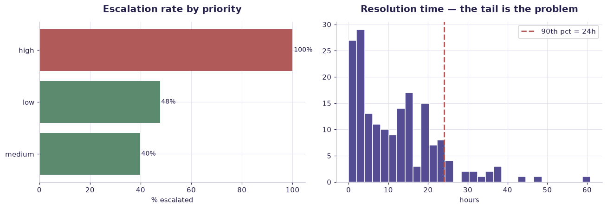

# Support tickets (synthetic) — worked solution

[](https://colab.research.google.com/github/RGarancs/applied-ai-academy-labs/blob/main/solutions/tickets.ipynb) &nbsp; [← back to the problem set](../tickets.ipynb)

**180 rows** · `support_tickets_sample.csv`

> Every number and chart below is the real output of the code shown.
> Try the problems yourself first — the point is the attempt, not the answer.

---

## Setup

<details><summary>Output</summary>

```
Shape: (180, 6)
  ticket_id customer_segment                                            message priority  resolved_hours  escalated
0     T0001       Enterprise  We need a data processing agreement for our le...     high            19.1          1
1     T0002       Enterprise  I want to upgrade but need a quote for 250 users.      low             3.1          0
2     T0003              SMB  I want to upgrade but need a quote for 250 users.      low             6.6          0
3     T0004              SMB  I was charged twice after changing my subscrip...   medium             8.1          0
4     T0005       Mid-market  We need a data processing agreement for our le...   medium             3.6          1
```

</details>

## What is in the file

```python
print("Columns and types:")
print(df.dtypes.to_string())
miss = df.isna().sum()
miss = miss[miss > 0]
print("\nMissing values:" if len(miss) else "\nNo missing values.")
if len(miss): print(miss.to_string())
```

<details><summary>Output</summary>

```
Columns and types:
ticket_id               str
customer_segment        str
message                 str
priority                str
resolved_hours      float64
escalated             int64

No missing values.
```

</details>

## Problem 1 · Easy — describe

How is support load distributed, and what gets escalated?

*Try it yourself first. The worked solution is below.*

```python
print(f"Tickets: {len(df)}")
print(f"Escalation rate: {df['escalated'].mean():.1%}")
print("\nBy priority:")
print(df.groupby("priority").agg(tickets=("ticket_id","size"),
                                 escalation_rate=("escalated","mean"),
                                 median_hours=("resolved_hours","median")).round(2))
print("\nBy customer segment:")
print(df.groupby("customer_segment").agg(tickets=("ticket_id","size"),
                                         escalation_rate=("escalated","mean")).round(3))
```

<details><summary>Output</summary>

```
Tickets: 180
Escalation rate: 58.3%

By priority:
          tickets  escalation_rate  median_hours
priority                                        
high           50             1.00         18.65
low            42             0.48          5.20
medium         88             0.40          5.75

By customer segment:
                  tickets  escalation_rate
customer_segment                          
Enterprise             60            0.600
Mid-market             58            0.621
SMB                    62            0.532
```

</details>

## Problem 2 · Intermediate — build

Which tickets are slow, and is slow the same as escalated?

*Try it yourself first. The worked solution is below.*

```python
print("Resolution hours:\n", df["resolved_hours"].describe().round(2))
q = df["resolved_hours"].quantile(.9)
print(f"\n90th percentile: {q:.1f}h — the tail is where reputation is lost.")
slow = df[df["resolved_hours"] >= q]
print("\nSlowest decile by priority:\n", slow["priority"].value_counts())
print("\nEscalated vs not, median hours:")
print(df.groupby("escalated")["resolved_hours"].median().round(2))
```

<details><summary>Output</summary>

```
Resolution hours:
 count    180.00
mean      12.01
std       10.43
min        0.00
25%        3.48
50%       10.25
75%       18.35
max       60.80
Name: resolved_hours, dtype: float64

90th percentile: 24.0h — the tail is where reputation is lost.

Slowest decile by priority:
 priority
high      8
medium    7
low       3
Name: count, dtype: int64

Escalated vs not, median hours:
escalated
0     5.8
1    13.7
Name: resolved_hours, dtype: float64
```

</details>

## Problem 3 · Advanced — judge

Triage rule: what would you automate, and what must stay human?

*Try it yourself first. The worked solution is below.*

```python
import re
kw = ["refund","cancel","legal","angry","urgent","broken","invoice","gdpr","data"]
low = df["message"].astype(str).str.lower()
for k in kw:
    hit = low.str.contains(k)
    if hit.sum() >= 3:
        print(f"{k:<9} n={hit.sum():3d}  escalation={df.loc[hit,'escalated'].mean():.0%}  "
              f"median_h={df.loc[hit,'resolved_hours'].median():.1f}")
print("\nA keyword with a high escalation rate is a candidate for a HUMAN gate,")
print("not for automation. Automate the confident, reversible middle.")
```

<details><summary>Output</summary>

```
cancel    n= 25  escalation=100%  median_h=7.9
legal     n= 29  escalation=100%  median_h=10.7
invoice   n= 22  escalation=36%  median_h=8.0
data      n= 45  escalation=78%  median_h=12.2

A keyword with a high escalation rate is a candidate for a HUMAN gate,
not for automation. Automate the confident, reversible middle.
```

</details>

## Visual summary

The same answers, as pictures. These are what to project — a room reads a chart
far faster than it reads a table, and the shape of a result is usually the
argument you are actually making.

```python
fig, ax = plt.subplots(1, 2, figsize=(12, 4.2))
r = df.groupby("priority")["escalated"].mean().mul(100).sort_values()
ax[0].barh(r.index, r.values, color=[CORE if v < 50 else DANGER for v in r])
ax[0].set_title("Escalation rate by priority"); ax[0].set_xlabel("% escalated")
for i, v in enumerate(r.values): ax[0].text(v + .5, i, f"{v:.0f}%", va="center", fontsize=9)

ax[1].hist(df["resolved_hours"].dropna(), bins=30, color=ACCENT, edgecolor="white")
q = df["resolved_hours"].quantile(.9)
ax[1].axvline(q, color=DANGER, ls="--", lw=2, label=f"90th pct = {q:.0f}h")
ax[1].set_title("Resolution time — the tail is the problem"); ax[1].set_xlabel("hours"); ax[1].legend()
plt.tight_layout(); plt.show()
```



<details><summary>Output</summary>

```
findfont: Failed to find font weight 600, now using 700.
```

</details>

## Verified answer key

These are the numbers the academy ships for this dataset. They were computed
from this exact file — if your run disagrees, reconcile before teaching it.

1. Overall escalation 58.3% — NOT a routine-heavy corpus
2. Priority mix: high 50 · medium 88 · low 42
3. High priority: 100% escalation, 19.9h avg resolution → draft-for-human territory
4. Medium 40% / low 48% escalation → AI-first-response candidates, not autonomous closure

## Teaching notes

* **Run the Easy problem live.** It sets the shared vocabulary and gets everyone
  looking at the same rows.
* **Let them fail on the Intermediate one.** The productive mistake is usually
  reaching for a model before checking the data.
* **Argue about the Advanced one.** It has no single right answer; it has a
  defensible one, and defending it is the skill being taught.
* **Always close on limitations.** Every dataset here has a real caveat —
  scrape bias, a tiny sample, a hindsight label. Naming it is the lesson.
* **Deliverable for learners:** AI-enhanced journey map + triage design with explicit escalation rules.

---
*Applied AI Academy · appliedai.center*

---

*Applied AI Academy · [appliedai.center](https://appliedai.center)*
