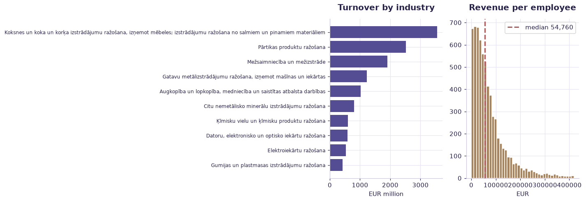

# Latvia Top-500 companies — analytics (case study) — worked solution

[](https://colab.research.google.com/github/RGarancs/applied-ai-academy-labs/blob/main/solutions/top500.ipynb) &nbsp; [← back to the problem set](../top500.ipynb)

**8,001 rows** · `latvia_top500_companies.csv`

> Every number and chart below is the real output of the code shown.
> Try the problems yourself first — the point is the attempt, not the answer.

---

## Setup

<details><summary>Output</summary>

```
Shape: (8001, 14)
   industry_code                                      industry_name  industry_company_count  industry_rank_turnover  \
0              1  Augkopība un lopkopība, medniecība un saistīta...                    2483                       1   
1              1  Augkopība un lopkopība, medniecība un saistīta...                    2483                       2   
2              1  Augkopība un lopkopība, medniecība un saistīta...                    2483                       3   
3              1  Augkopība un lopkopība, medniecība un saistīta...                    2483                       4   
4              1  Augkopība un lopkopība, medniecība un saistīta...                    2483                       5   

                  company       reg_no      location  latest_year  turnover_eur  profit_eur   assets_eur  employees  \
0          AS "Balticovo"  40003058863  Bauskas nov.       2025.0     161551362    35937312  185469370.0        406   
1       AS "Ķekava Foods"  50003007411  Ķekavas nov.       2024.0     126483184     7264397   72551814.0        902   
2           SIA "GAIŽĒNI"  44101019987     Cēsu nov.       2025.0      17101286     3009832   32019189.0         68   
3           AS "ZIEDI JP"  45101000230  Dobeles nov.       2025.0      15633735     2950606   31646894.0         99   
4  AS "AGROFIRMA TĒRVETE"  45103001086  Dobeles nov.       2025.0      14651784    -1191164   61196393.0        163   

   industry_avg_net_salary_eur                         page_url  
0                  1360.735607  https://saraksts.lv/40003058863  
1                  1202.812908  https://saraksts.lv/50003007411  
2                  1577.226802  https://saraksts.lv/44101019987  
3                   943.702943  https://saraksts.lv/45101000230  
4                  1193.817020  https://saraksts.lv/45103001086
```

</details>

## What is in the file

```python
print("Columns and types:")
print(df.dtypes.to_string())
miss = df.isna().sum()
miss = miss[miss > 0]
print("\nMissing values:" if len(miss) else "\nNo missing values.")
if len(miss): print(miss.to_string())
```

<details><summary>Output</summary>

```
Columns and types:
industry_code                    int64
industry_name                      str
industry_company_count           int64
industry_rank_turnover           int64
company                            str
reg_no                           int64
location                           str
latest_year                    float64
turnover_eur                     int64
profit_eur                       int64
assets_eur                     float64
employees                        int64
industry_avg_net_salary_eur    float64
page_url                           str

Missing values:
latest_year                      52
assets_eur                       52
industry_avg_net_salary_eur    1713
```

</details>

## Problem 1 · Easy — describe

Which 5 industries have the highest total turnover? Compute median turnover and median employees per company. Which industry pays the highest average net salary?

*Try it yourself first. The worked solution is below.*

```python
print(f"Companies: {len(df):,}")
print(f"Total turnover: EUR {df['turnover_eur'].sum()/1e9:,.1f} bn")
print(f"Total employees: {df['employees'].sum():,.0f}")
print("\nTop 10 by turnover:")
print(df.nlargest(10, "turnover_eur")[["company","industry_name","turnover_eur","employees"]]
        .assign(turnover_mn=lambda d: (d.turnover_eur/1e6).round(1))
        .drop(columns="turnover_eur").to_string(index=False))
```

<details><summary>Output</summary>

```
Companies: 8,001
Total turnover: EUR 17.1 bn
Total employees: 126,874

Top 10 by turnover:
                   company                                                                                                             industry_name  employees  turnover_mn
 AS "Latvijas valsts meži"                                                                                             Mežsaimniecība un mežizstrāde       1443        604.6
    AS "LATVIJAS FINIERIS" Koksnes un koka un korķa izstrādājumu ražošana, izņemot mēbeles; izstrādājumu ražošana no salmiem un pinamiem materiāliem       1500        419.6
          SIA "Mikrotīkls"                                                                          Datoru, elektronisko un optisko iekārtu ražošana        377        326.7
 AS "Dobeles dzirnavnieks"                                                                                                Pārtikas produktu ražošana        471        289.2
      SIA "KRONOSPAN Riga" Koksnes un koka un korķa izstrādājumu ražošana, izņemot mēbeles; izstrādājumu ražošana no salmiem un pinamiem materiāliem        270        222.2
             SIA "LATGRAN" Koksnes un koka un korķa izstrādājumu ražošana, izņemot mēbeles; izstrādājumu ražošana no salmiem un pinamiem materiāliem        126        221.2
           SIA "Bio-Venta"                                                                                Ķīmisku vielu un ķīmisku produktu ražošana         70        174.9
            AS "Balticovo"                                                         Augkopība un lopkopība, medniecība un saistītas atbalsta darbības        406        161.6
       SIA "LEXEL FABRIKA"                                                                                                   Elektroiekārtu ražošana        291        156.1
AS "RĪGAS PIENA KOMBINĀTS"                                                                                                Pārtikas produktu ražošana        861        150.9
```

</details>

## Problem 2 · Intermediate — build

Compute revenue-per-employee and net margin (profit/turnover) by industry. Rank industries on both. Where is the "productivity paradox" (high revenue/employee but low margin, or vice versa)?

*Try it yourself first. The worked solution is below.*

```python
ind = (df.groupby("industry_name")
         .agg(companies=("company","size"), turnover=("turnover_eur","sum"),
              employees=("employees","sum"), profit=("profit_eur","sum"))
         .sort_values("turnover", ascending=False))
ind["turnover_mn"] = (ind["turnover"]/1e6).round(0)
ind["margin_%"] = (ind["profit"]/ind["turnover"]*100).round(1)
ind["turnover_per_employee"] = (ind["turnover"]/ind["employees"]).round(0)
print(ind[["companies","turnover_mn","margin_%","turnover_per_employee"]].head(12))
```

<details><summary>Output</summary>

```
                                                    companies  turnover_mn  margin_%  turnover_per_employee
industry_name                                                                                              
Koksnes un koka un korķa izstrādājumu ražošana,...        500       3557.0       4.0               183177.0
Pārtikas produktu ražošana                                500       2520.0       3.4               138835.0
Mežsaimniecība un mežizstrāde                             500       1905.0      14.1               228421.0
Gatavu metālizstrādājumu ražošana, izņemot mašī...        500       1222.0       3.2                97909.0
Augkopība un lopkopība, medniecība un saistītas...        500       1016.0       9.3               119472.0
Citu nemetālisko minerālu izstrādājumu ražošana           447        801.0       7.5               141325.0
Ķīmisku vielu un ķīmisku produktu ražošana                305        603.0       5.9               199372.0
Datoru, elektronisko un optisko iekārtu ražošana          198        579.0      18.3               210093.0
Elektroiekārtu ražošana                                   163        537.0       9.2               131925.0
Gumijas un plastmasas izstrādājumu ražošana               252        417.0       2.5               115064.0
Cita ieguves rūpniecība un karjeru izstrāde               304        407.0      15.7               123351.0
Dzērienu ražošana                                         220        404.0       7.3               165805.0
```

</details>

## Problem 3 · Advanced — judge

Build the investor decision brief: cluster industries by size/margin/productivity, flag the 3 most attractive and 3 most fragile, and write the caveats (turnover != profit; survivorship — these are TOP firms only, no failed companies).

*Try it yourself first. The worked solution is below.*

```python
d = df[(df.turnover_eur > 0) & (df.employees > 0)].copy()
d["rev_per_emp"] = d["turnover_eur"] / d["employees"]
d["margin"] = d["profit_eur"] / d["turnover_eur"]
print("Revenue per employee (EUR):\n", d["rev_per_emp"].describe().round(0))
print("\nMost productive (>=100 employees):")
print(d[d.employees >= 100].nlargest(8, "rev_per_emp")
        [["company","industry_name","employees","rev_per_emp"]].round(0).to_string(index=False))
print(f"\nCorrelation size vs margin: {d['employees'].corr(d['margin']):.2f}")
print("\nCaveat: a single reporting year, self-declared, and revenue per employee")
print("flatters trading businesses over manufacturers. Compare within an industry.")
```

<details><summary>Output</summary>

```
Revenue per employee (EUR):
 count        6675.0
mean       107531.0
std        634105.0
min             3.0
25%         25781.0
50%         54760.0
75%        102231.0
max      44576635.0
Name: rev_per_emp, dtype: float64

Most productive (>=100 employees):
                  company                                                                                                             industry_name  employees  rev_per_emp
            SIA "LATGRAN" Koksnes un koka un korķa izstrādājumu ražošana, izņemot mēbeles; izstrādājumu ražošana no salmiem un pinamiem materiāliem        126    1755770.0
         SIA "Mikrotīkls"                                                                          Datoru, elektronisko un optisko iekārtu ražošana        377     866526.0
     SIA "KRONOSPAN Riga" Koksnes un koka un korķa izstrādājumu ražošana, izņemot mēbeles; izstrādājumu ražošana no salmiem un pinamiem materiāliem        270     822829.0
  AS "STORA ENSO LATVIJA" Koksnes un koka un korķa izstrādājumu ražošana, izņemot mēbeles; izstrādājumu ražošana no salmiem un pinamiem materiāliem        220     680302.0
          SIA "Vika Wood" Koksnes un koka un korķa izstrādājumu ražošana, izņemot mēbeles; izstrādājumu ražošana no salmiem un pinamiem materiāliem        138     634660.0
AS "Dobeles dzirnavnieks"                                                                                                Pārtikas produktu ražošana        471     614028.0
      SIA "LEXEL FABRIKA"                                                                                                   Elektroiekārtu ražošana        291     536418.0
            SIA "KUREKSS" Koksnes un koka un korķa izstrādājumu ražošana, izņemot mēbeles; izstrādājumu ražošana no salmiem un pinamiem materiāliem        146     500000.0

Correlation size vs margin: 0.01

Caveat: a single reporting year, self-declared, and revenue per employee
flatters trading businesses over manufacturers. Compare within an industry.
```

</details>

## Visual summary

The same answers, as pictures. These are what to project — a room reads a chart
far faster than it reads a table, and the shape of a result is usually the
argument you are actually making.

```python
ind = (df.groupby("industry_name")
         .agg(turnover=("turnover_eur","sum"), employees=("employees","sum"))
         .sort_values("turnover").tail(10))
fig, ax = plt.subplots(1, 2, figsize=(13, 4.6))
ax[0].barh(ind.index, ind["turnover"]/1e6, color=ACCENT)
ax[0].set_title("Turnover by industry"); ax[0].set_xlabel("EUR million")
ax[0].tick_params(axis="y", labelsize=8)

d = df[(df.turnover_eur > 0) & (df.employees > 0)].copy()
d["rpe"] = d.turnover_eur / d.employees
ax[1].hist(d[d.rpe < d.rpe.quantile(.97)]["rpe"], bins=40, color=BUILDER, edgecolor="white")
ax[1].axvline(d.rpe.median(), color=DANGER, ls="--", lw=2, label=f"median {d.rpe.median():,.0f}")
ax[1].set_title("Revenue per employee"); ax[1].set_xlabel("EUR"); ax[1].legend()
plt.tight_layout(); plt.show()
```



<details><summary>Output</summary>

```
findfont: Failed to find font weight 600, now using 700.
```

</details>

## Verified answer key

These are the numbers the academy ships for this dataset. They were computed
from this exact file — if your run disagrees, reconcile before teaching it.

1. 8,001 top firms across ~85 industries (top 500 per industry). Median company turnover €282,710
2. Decision-intelligence lesson: rank on revenue-per-employee and MARGIN, not raw turnover — big != profitable
3. Survivorship built in: these are the TOP companies — no bankruptcies — so "average industry health" is overstated
4. Latvian text in industry_name (Augkopiba, Mezsaimnieciba...) — a real multilingual-data + AI-translation exercise

## Teaching notes

* **Run the Easy problem live.** It sets the shared vocabulary and gets everyone
  looking at the same rows.
* **Let them fail on the Intermediate one.** The productive mistake is usually
  reaching for a model before checking the data.
* **Argue about the Advanced one.** It has no single right answer; it has a
  defensible one, and defending it is the skill being taught.
* **Always close on limitations.** Every dataset here has a real caveat —
  scrape bias, a tiny sample, a hindsight label. Naming it is the lesson.
* **Deliverable for learners:** The board-ready AI transformation roadmap + your pushback Q&A. This is the course capstone — save it in notes and export it.

---
*Applied AI Academy · appliedai.center*

---

*Applied AI Academy · [appliedai.center](https://appliedai.center)*
