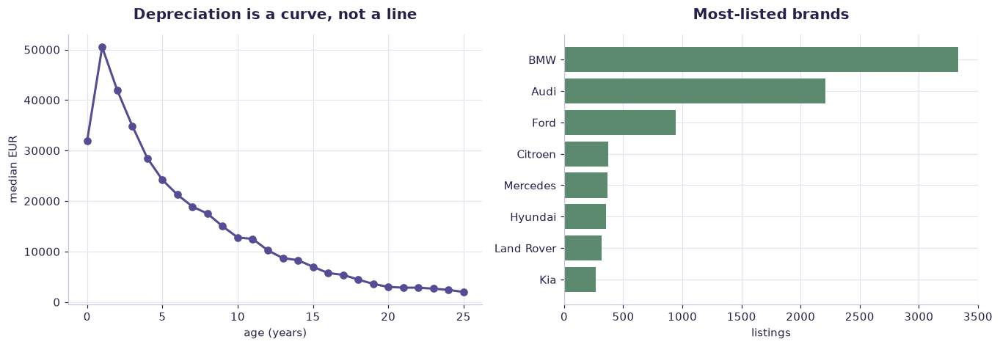

# Used cars — depreciation & price (case study) — worked solution

[](https://colab.research.google.com/github/RGarancs/applied-ai-academy-labs/blob/main/solutions/usedcars.ipynb) &nbsp; [← back to the problem set](../usedcars.ipynb)

**10,000 rows** · `ss_used_cars.csv`

> Every number and chart below is the real output of the code shown.
> Try the problems yourself first — the point is the attempt, not the answer.

---

## Setup

<details><summary>Output</summary>

```
Shape: (10000, 33)
        brand model  year  age_years  year_cluster  price_eur price_band  mileage_km  mileage_th_km  mileage_band  \
0  Alfa Romeo   147  2004         22  Older (11y+)    18900.0  15k-30k €     93964.0         93.964   50k-100k km   
1  Alfa Romeo   147  2006         20  Older (11y+)      820.0      <1k €    188720.0        188.720  150k-200k km   
2  Alfa Romeo   147  2010         16  Older (11y+)     1000.0    1k-3k €    202000.0        202.000  200k-300k km   
3  Alfa Romeo   155  1996         30  Older (11y+)     9900.0   7k-15k €    109133.0        109.133  100k-150k km   
4  Alfa Romeo   156  2000         26  Older (11y+)      700.0      <1k €    258000.0        258.000  200k-300k km   

        engine  engine_volume_l engine_type      transmission body_type     car_type_cluster             color  \
0  3.2 benzīns              3.2      Petrol  Manuāla 6 ātrumi   Hečbeks  City hatchback type    Melna metālika   
1  1.6 benzīns              1.6      Petrol           Manuāla   Hečbeks  City hatchback type              Zila   
2  1.6 benzīns              1.6      Petrol  Manuāla 5 ātrumi   Hečbeks  City hatchback type             Melna   
3  2.5 benzīns              2.5      Petrol  Manuāla 5 ātrumi    Sedans  Business sedan type  Sudraba metālika   
4  1.9 dīzelis              1.9      Diesel           Manuāla    Sedans  Business sedan type              Zila   

          location listing_type technical_inspection  photo_count  description_length  has_phone  has_vin  \
0             Rīga       Pārdod              07.2027           26                   0       True    False   
1  Jelgava un raj.       Pārdod              08.2026            9                   0       True    False   
2             Rīga       Pārdod              08.2026            5                   0       True    False   
3             Rīga       Pārdod         Bez apskates           18                   0       True    False   
4             Rīga       Pārdod              01.2027           14                   0       True    False   

    date_posted  scraped_at_utc                                         page_title  \
0  46194.761111    46209.803970  SS.COM Alfa Romeo 147, Cena 18 900 €. Alfa Rom...   
1  46203.724306    46209.803959  SS.COM Alfa Romeo 147, Cena 820 €. Pārdodās Al...   
2  46193.665278    46209.803970  SS.COM Alfa Romeo 147, Cena 1 000 €. Продам ав...   
3  46190.279861    46209.803985  SS.COM Alfa Romeo 155, Cena 9 900 €. Pārdod 19...   
4  46180.464583    46209.803955  SS.COM Alfa Romeo 156, Cena 700 €. Alfa Romeo ...   

                                    meta_description                                         source_url  \
0  Sludinājumi. Vieglie auto - Alfa Romeo - 147, ...  https://www.ss.com/msg/lv/transport/cars/alfa-...   
1  Sludinājumi. Vieglie auto - Alfa Romeo - 147, ...  https://www.ss.com/msg/lv/transport/cars/alfa-...   
2  Sludinājumi. Vieglie auto - Alfa Romeo - 147, ...  https://www.ss.com/msg/lv/transport/cars/alfa-...   
3  Sludinājumi. Vieglie auto - Alfa Romeo - 155, ...  https://www.ss.com/msg/lv/transport/cars/alfa-...   
4  Sludinājumi. Vieglie auto - Alfa Romeo - 156, ...  https://www.ss.com/msg/lv/transport/cars/alfa-...   

      phone_masked          vin_code  ad_id       stable_row_id  
0  (+371)29-19-***  Parādīt vin kodu  gkplb  gkplb-2275354422ca  
1  (+371)28-34-***  Parādīt vin kodu  cxepi  cxepi-9d87aaa330fb  
2  (+371)26-90-***  Parādīt vin kodu  gjcln  gjcln-7b528a1b17cc  
3  (+371)29-10-***  Parādīt vin kodu  himnj  himnj-de27059dd721  
4  (+371)26-61-***  Parādīt vin kodu  fhgfh  fhgfh-5159428356da
```

</details>

## What is in the file

```python
print("Columns and types:")
print(df.dtypes.to_string())
miss = df.isna().sum()
miss = miss[miss > 0]
print("\nMissing values:" if len(miss) else "\nNo missing values.")
if len(miss): print(miss.to_string())
```

<details><summary>Output</summary>

```
Columns and types:
brand                       str
model                       str
year                      int64
age_years                 int64
year_cluster                str
price_eur               float64
price_band                  str
mileage_km              float64
mileage_th_km           float64
mileage_band                str
engine                      str
engine_volume_l         float64
engine_type                 str
transmission                str
body_type                   str
car_type_cluster            str
color                       str
location                    str
listing_type                str
technical_inspection        str
photo_count               int64
description_length        int64
has_phone                  bool
has_vin                    bool
date_posted             float64
scraped_at_utc          float64
page_title                  str
meta_description            str
source_url                  str
phone_masked                str
vin_code                    str
ad_id                       str
stable_row_id               str

Missing values:
model                38
price_eur            10
mileage_km         1316
mileage_th_km      1316
engine              259
engine_volume_l     259
color               169
location              2
phone_masked         15
vin_code             38
```

</details>

## Problem 1 · Easy — describe

How does median price fall with age (0–5 / 6–10 / 11+ years)? Which 3 brands hold value best? Is the price–mileage relationship linear or curved?

*Try it yourself first. The worked solution is below.*

```python
print(f"Listings: {len(df):,}")
print(f"Median price: EUR {df['price_eur'].median():,.0f}")
print("\nTop brands:\n", df["brand"].value_counts().head(10))
print("\nPrice by age band:")
print(df.groupby("mileage_band")["price_eur"].agg(n="size", median="median").round(0))
print(f"\nCorrelation age vs price:     {df['age_years'].corr(df['price_eur']):.2f}")
print(f"Correlation mileage vs price: {df['mileage_km'].corr(df['price_eur']):.2f}")
```

<details><summary>Output</summary>

```
Listings: 10,000
Median price: EUR 8,200

Top brands:
 brand
BMW           3446
Audi          2396
Ford           967
Mercedes       391
Citroen        376
Hyundai        360
Land Rover     334
Kia            269
Lexus          191
Mazda          178
Name: count, dtype: int64

Price by age band:
                 n   median
mileage_band               
100k-150k km   774  16600.0
150k-200k km  1237  12590.0
200k-300k km  3364   7850.0
300k-500k km  2187   4300.0
500k+ km        50   2325.0
50k-100k km    597  23700.0
<50k km       1791   9900.0

Correlation age vs price:     -0.61
Correlation mileage vs price: -0.60
```

</details>

## Problem 2 · Intermediate — build

Train a regression on age, mileage, engine_volume, brand, body_type. Compare a linear model vs gradient-boosted trees on MAE. Where does linear fail (luxury brands, very old cars)?

*Try it yourself first. The worked solution is below.*

```python
from sklearn.linear_model import LinearRegression
from sklearn.ensemble import RandomForestRegressor
from sklearn.model_selection import train_test_split
from sklearn.metrics import mean_absolute_error

d = df.dropna(subset=["price_eur","age_years","mileage_km","engine_volume_l"]).copy()
d = d[d.price_eur.between(300, 150_000)]
feat = ["age_years","mileage_km","engine_volume_l","brand","transmission","engine_type","body_type"]
X = pd.get_dummies(d[feat], drop_first=True)
y = d["price_eur"]
Xtr, Xte, ytr, yte = train_test_split(X, y, test_size=.25, random_state=42)

lin = LinearRegression().fit(Xtr, ytr)
rf  = RandomForestRegressor(n_estimators=200, random_state=42, n_jobs=-1).fit(Xtr, ytr)
mae_lin = mean_absolute_error(yte, lin.predict(Xte))
mae_rf  = mean_absolute_error(yte, rf.predict(Xte))
print(f"n = {len(d):,}")
print(f"Linear MAE: EUR {mae_lin:,.0f}")
print(f"Forest MAE: EUR {mae_rf:,.0f}   ({(1-mae_rf/mae_lin):.0%} better)")
print("\nDepreciation is non-linear, so a tree beats a straight line here.")
imp = pd.Series(rf.feature_importances_, index=X.columns).sort_values(ascending=False)
print("\nTop features:\n", imp.head(6).round(3))
```

<details><summary>Output</summary>

```
n = 8,420
Linear MAE: EUR 4,756
Forest MAE: EUR 2,405   (49% better)

Depreciation is non-linear, so a tree beats a straight line here.

Top features:
 age_years            0.562
engine_volume_l      0.233
mileage_km           0.127
brand_BMW            0.010
body_type_Apvidus    0.007
brand_Mercedes       0.005
dtype: float64
```

</details>

## Problem 3 · Advanced — judge

Model log(price) and quantify each brand's "premium" after controlling for age & mileage. Argue: does this problem justify deep learning, or would explainable trees win in a regulated resale context? Write the deployment checklist.

*Try it yourself first. The worked solution is below.*

```python
import numpy as np
d = df.dropna(subset=["price_eur","age_years"]).copy()
d = d[d.price_eur.between(300, 150_000) & d.age_years.between(0, 30)]
curve = d.groupby("age_years")["price_eur"].median()
print("Median price by age (EUR):\n", curve.head(16).round(0))

first = curve.loc[curve.index <= 1].mean()
y5 = curve.loc[curve.index.isin([5])].mean()
if first and y5:
    print(f"\nValue retained at 5 years: {y5/first:.0%}")
print("""
Where a model like this must NOT be used
  · as a trade-in offer without a physical inspection (condition is absent)
  · on brands/models with very few listings — the estimate is noise
  · on ASKING prices as if they were sale prices; sellers negotiate down
""")
```

<details><summary>Output</summary>

```
Median price by age (EUR):
 age_years
0     31900.0
1     50500.0
2     41950.0
3     34900.0
4     28500.0
5     24200.0
6     21250.0
7     18900.0
8     17500.0
9     15000.0
10    12790.0
11    12500.0
12    10250.0
13     8700.0
14     8300.0
15     6990.0
Name: price_eur, dtype: float64

Value retained at 5 years: 59%

Where a model like this must NOT be used
  · as a trade-in offer without a physical inspection (condition is absent)
  · on brands/models with very few listings — the estimate is noise
  · on ASKING prices as if they were sale prices; sellers negotiate down
```

</details>

## Visual summary

The same answers, as pictures. These are what to project — a room reads a chart
far faster than it reads a table, and the shape of a result is usually the
argument you are actually making.

```python
d = df[df.price_eur.between(300, 150_000) & df.age_years.between(0, 25)]
fig, ax = plt.subplots(1, 2, figsize=(12.5, 4.4))
curve = d.groupby("age_years")["price_eur"].median()
ax[0].plot(curve.index, curve.values, marker="o", color=ACCENT, lw=2)
ax[0].set_title("Depreciation is a curve, not a line"); ax[0].set_xlabel("age (years)"); ax[0].set_ylabel("median EUR")

b = d["brand"].value_counts().head(8).sort_values()
ax[1].barh(b.index, b.values, color=CORE)
ax[1].set_title("Most-listed brands"); ax[1].set_xlabel("listings")
plt.tight_layout(); plt.show()
```



<details><summary>Output</summary>

```
findfont: Failed to find font weight 600, now using 700.
```

</details>

## Verified answer key

These are the numbers the academy ships for this dataset. They were computed
from this exact file — if your run disagrees, reconcile before teaching it.

1. Median price €8,200. Depreciation is steep and non-linear: 0–5y median €30,900 → 6–10y €16,100 → 11+ €5,550
2. Most-listed brands: BMW (3,446), Audi (2,396), Ford (967) — a German-heavy Baltic market
3. Price–mileage and price–age are CURVED (exponential decay) — a linear model underprices new cars and overprices old ones; log-price or trees fix it
4. Great "model choice court": trees usually beat a plain linear model here, but explainability may still favour the simpler model for a resale guarantee

## Teaching notes

* **Run the Easy problem live.** It sets the shared vocabulary and gets everyone
  looking at the same rows.
* **Let them fail on the Intermediate one.** The productive mistake is usually
  reaching for a model before checking the data.
* **Argue about the Advanced one.** It has no single right answer; it has a
  defensible one, and defending it is the skill being taught.
* **Always close on limitations.** Every dataset here has a real caveat —
  scrape bias, a tiny sample, a hindsight label. Naming it is the lesson.
* **Deliverable for learners:** Vendor scorecard + a one-paragraph sourcing recommendation with the two assumptions that would change it.

---
*Applied AI Academy · appliedai.center*

---

*Applied AI Academy · [appliedai.center](https://appliedai.center)*
