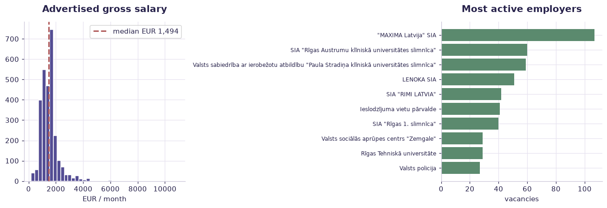

# Latvia job vacancies — real labor market (case study) — worked solution

[](https://colab.research.google.com/github/RGarancs/applied-ai-academy-labs/blob/main/solutions/vacancies.ipynb) &nbsp; [← back to the problem set](../vacancies.ipynb)

**3,491 rows** · `latvia_job_vacancies.csv`

> Every number and chart below is the real output of the code shown.
> Try the problems yourself first — the point is the attempt, not the answer.

---

## Setup

<details><summary>Output</summary>

```
Shape: (3491, 5)
                               position                                        company  \
0                              APKOPĒJS  Sabiedrība ar ierobežotu atbildību "FOREVERS"   
1  MAZUMTIRDZNIECĪBAS VEIKALA PĀRDEVĒJS  Sabiedrība ar ierobežotu atbildību "FOREVERS"   
2  MAZUMTIRDZNIECĪBAS VEIKALA PĀRDEVĒJS  Sabiedrība ar ierobežotu atbildību "FOREVERS"   
3              IESAIŅOTĀJS (ROKU DARBS)                           "MAXIMA Latvija" SIA   
4  MAZUMTIRDZNIECĪBAS VEIKALA PĀRDEVĒJS                           "MAXIMA Latvija" SIA   

                                        work_address     salary_gross valid_until  
0                              Granīta iela 9A, Rīga   960 - 1200 EUR  31.10.2025  
1  Jūrmalas iela 14, Piņķi, Babītes pag., Mārupes...   900 - 1100 EUR  31.10.2025  
2  Atpūtas iela 1, Carnikava, Carnikavas pag., Ād...   900 - 1100 EUR  31.10.2025  
3                      Augusta Deglava iela 67, Rīga  5.25 - 5.45 EUR  31.10.2025  
4                              Slokas iela 115, Rīga   5.3 - 5.75 EUR  31.10.2025
```

</details>

## What is in the file

```python
print("Columns and types:")
print(df.dtypes.to_string())
miss = df.isna().sum()
miss = miss[miss > 0]
print("\nMissing values:" if len(miss) else "\nNo missing values.")
if len(miss): print(miss.to_string())
```

<details><summary>Output</summary>

```
Columns and types:
position        str
company         str
work_address    str
salary_gross    str
valid_until     str

Missing values:
work_address    2
```

</details>

## Problem 1 · Easy — describe

What does the Latvian vacancy market look like?

*Try it yourself first. The worked solution is below.*

```python
print(f"Vacancies: {len(df):,}")
print("\nTop employers:\n", df["company"].value_counts().head(10))
print("\nTop locations (from work_address):")
print(df["work_address"].astype(str).str.extract(r"([A-ZĀČĒĢĪĶĻŅŠŪŽ][a-zāčēģīķļņšūž]+)")[0]
        .value_counts().head(10))
```

<details><summary>Output</summary>

```
Vacancies: 3,491

Top employers:
 company
"MAXIMA Latvija" SIA                                                                          107
SIA "Rīgas Austrumu klīniskā universitātes slimnīca"                                           60
Valsts sabiedrība ar ierobežotu atbildību "Paula Stradiņa klīniskā universitātes slimnīca"     59
LENOKA SIA                                                                                     51
SIA "RIMI LATVIA"                                                                              42
Ieslodzījuma vietu pārvalde                                                                    41
SIA "Rīgas 1. slimnīca"                                                                        40
Rīgas Tehniskā universitāte                                                                    29
Valsts sociālās aprūpes centrs "Zemgale"                                                       29
Valsts policija                                                                                27
Name: count, dtype: int64

Top locations (from work_address):
0
Brīvības      92
Rīgas         83
Rīga          63
Pilsoņu       61
Hipokrāta     56
Krišjāņa      52
Raiņa         51
Bruņinieku    49
Skolas        45
Lielā         36
Name: count, dtype: int64
```

</details>

## Problem 2 · Intermediate — build

Parse the salary text into numbers — carefully.

*Try it yourself first. The worked solution is below.*

```python
s = df["salary_gross"].astype(str)
nums = s.str.replace(r"[^\d\-–]", " ", regex=True).str.split()
def mid(v):
    vals = [float(x) for x in v if x.replace('.','').isdigit()]
    vals = [x for x in vals if 200 <= x <= 20000]     # plausible monthly gross
    return sum(vals)/len(vals) if vals else None
df["salary_mid"] = nums.apply(mid)
print(f"Rows with a usable salary: {df['salary_mid'].notna().sum():,} of {len(df):,}")
print(df["salary_mid"].describe().round(0))
print(f"\nMedian advertised gross: EUR {df['salary_mid'].median():,.0f}")
```

<details><summary>Output</summary>

```
Rows with a usable salary: 2,797 of 3,491
count     2797.0
mean      1518.0
std        672.0
min        200.0
25%       1102.0
50%       1494.0
75%       1700.0
max      10953.0
Name: salary_mid, dtype: float64

Median advertised gross: EUR 1,494
```

</details>

## Problem 3 · Advanced — judge

Which roles pay most — and what is the honest caveat?

*Try it yourself first. The worked solution is below.*

```python
top = (df.dropna(subset=["salary_mid"])
         .groupby("position")["salary_mid"].agg(n="size", median="median")
         .query("n >= 5").sort_values("median", ascending=False))
print("Best-paid roles (>=5 postings):\n", top.head(12).round(0))
print("\nLowest:\n", top.tail(6).round(0))
print("\nCaveat: these are ADVERTISED gross ranges, not paid salaries, and only")
print("a subset of ads state pay at all — that is a selection bias, so treat")
print("this as a picture of what employers ADVERTISE, not what people earn.")
```

<details><summary>Output</summary>

```
Best-paid roles (>=5 postings):
                                                      n  median
position                                                      
ZOBĀRSTS                                             7  3500.0
SISTĒMANALĪTIĶIS                                     5  3325.0
PROGRAMMĒTĀJS                                        7  3092.0
NEIROLOGS                                            6  3004.0
FIZIKĀLĀS UN REHABILITĀCIJAS MEDICĪNAS ĀRSTS         7  3000.0
KARDIOLOGS                                           6  2779.0
BŪVDARBU VADĪTĀJS                                    8  2625.0
VADĪTĀJS /DIREKTORS /PĀRVALDNIEKS (IZGLĪTĪBAS J...   6  2592.0
PAMATDARBĪBAS STRUKTŪRVIENĪBAS VADĪTĀJS /DIREKT...   5  2516.0
PĒTNIEKS                                            10  2500.0
KLIENTU APKALPOŠANAS OPERATORS                       9  2125.0
VIRSMĀSA                                             6  2045.0

Lowest:
                              n  median
position                              
APRŪPĒTĀJS                  31   875.0
APKURES /KRĀŠŅU KURINĀTĀJS   5   778.0
FRIZIERIS                    5   740.0
APKOPĒJS                    58   740.0
SĒTNIEKS                    26   740.0
LOGOPĒDS                     5   702.0

Caveat: these are ADVERTISED gross ranges, not paid salaries, and only
a subset of ads state pay at all — that is a selection bias, so treat
this as a picture of what employers ADVERTISE, not what people earn.
```

</details>

## Visual summary

The same answers, as pictures. These are what to project — a room reads a chart
far faster than it reads a table, and the shape of a result is usually the
argument you are actually making.

```python
s = df["salary_gross"].astype(str).str.replace(r"[^\d\-–]", " ", regex=True).str.split()
def mid(v):
    vals = [float(x) for x in v if x.replace('.','').isdigit()]
    vals = [x for x in vals if 200 <= x <= 20000]
    return sum(vals)/len(vals) if vals else None
sal = s.apply(mid).dropna()

fig, ax = plt.subplots(1, 2, figsize=(12, 4.2))
ax[0].hist(sal, bins=40, color=ACCENT, edgecolor="white")
ax[0].axvline(sal.median(), color=DANGER, ls="--", lw=2, label=f"median EUR {sal.median():,.0f}")
ax[0].set_title("Advertised gross salary"); ax[0].set_xlabel("EUR / month"); ax[0].legend()

top = df["company"].value_counts().head(10).sort_values()
ax[1].barh(top.index, top.values, color=CORE)
ax[1].set_title("Most active employers"); ax[1].set_xlabel("vacancies")
ax[1].tick_params(axis="y", labelsize=8)
plt.tight_layout(); plt.show()
```



<details><summary>Output</summary>

```
findfont: Failed to find font weight 600, now using 700.
```

</details>

## Verified answer key

These are the numbers the academy ships for this dataset. They were computed
from this exact file — if your run disagrees, reconcile before teaching it.

1. 3,491 real vacancies; ~2,800 list a parseable salary → median €1,494 gross (below the ~€1,500 national average)
2. Rīga dominates: 1,541 of 3,491 (44%) — the capital-concentration story in one column
3. Top roles are manual/service: labourer (213), HGV driver (137), retail seller (113), cleaner (82)
4. The AI trap: ~20% of rows have no numeric salary — a naive parser silently drops them and biases the median upward
5. Great GenAI use case: title → occupation family (ISCO) is a classification task AI does well but must be spot-checked

## Teaching notes

* **Run the Easy problem live.** It sets the shared vocabulary and gets everyone
  looking at the same rows.
* **Let them fail on the Intermediate one.** The productive mistake is usually
  reaching for a model before checking the data.
* **Argue about the Advanced one.** It has no single right answer; it has a
  defensible one, and defending it is the skill being taught.
* **Always close on limitations.** Every dataset here has a real caveat —
  scrape bias, a tiny sample, a hindsight label. Naming it is the lesson.
* **Deliverable for learners:** Workflow redesign canvas (before/after + classifications + controls) and the human ownership map.

---
*Applied AI Academy · appliedai.center*

---

*Applied AI Academy · [appliedai.center](https://appliedai.center)*
